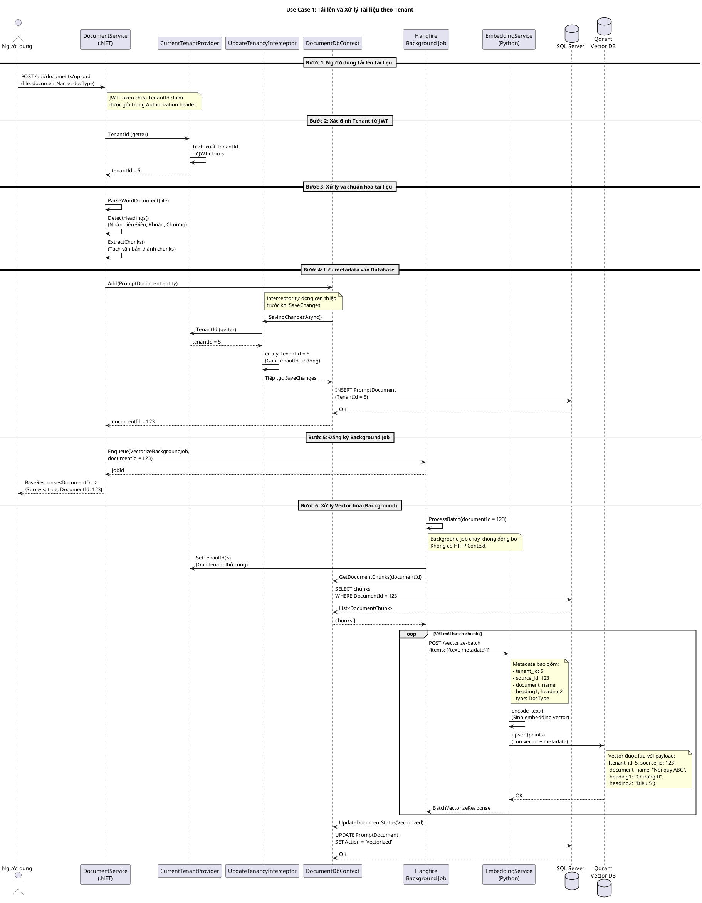
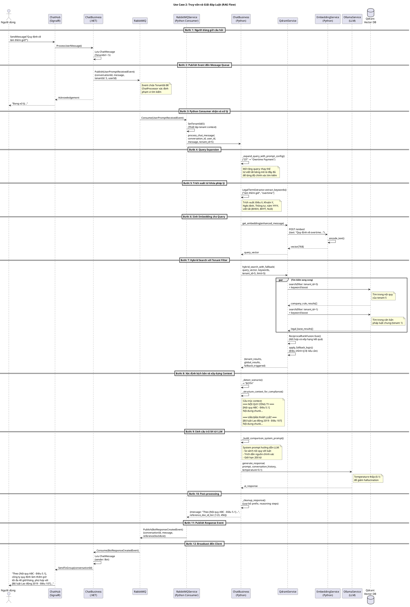

# 4.2.2 Thiết kế lớp (Class Design)

Phần này trình bày chi tiết thiết kế các lớp chủ đạo trong hai luồng xử lý cốt lõi của hệ thống: **Cô lập Multi-tenant** và **RAG (Retrieval-Augmented Generation)**. Mỗi lớp được mô tả với đầy đủ các thuộc tính, phương thức cùng với vai trò cụ thể trong kiến trúc tổng thể.

---

## 4.2.2.1 Luồng Cô lập Multi-tenant

Hệ thống Multi-tenant được thiết kế với mục tiêu đảm bảo dữ liệu của mỗi doanh nghiệp (tenant) được cô lập hoàn toàn, không bị truy cập hoặc ảnh hưởng bởi các tenant khác. Các lớp chủ đạo sau đây đóng vai trò then chốt trong việc thực hiện cơ chế cô lập này.

### A. Lớp CurrentTenantProvider

**Vị trí:** `Infrastructure/Tenancy/CurrentTenantProvider.cs`

**Vai trò:** Đây là lớp trung tâm trong việc xác định và cung cấp thông tin Tenant hiện tại cho toàn bộ hệ thống. Lớp này hỗ trợ hai cơ chế lấy TenantId: từ HTTP Context (JWT claims) và từ gán thủ công (cho các tiến trình nền như RabbitMQ consumer).

| STT | Tên thuộc tính | Kiểu dữ liệu | Vai trò |
|-----|----------------|--------------|---------|
| 1 | _currentUserProvider | ICurrentUserProvider? | Dependency injection để truy xuất TenantId từ JWT token trong HTTP Context. Cho phép null để hỗ trợ các tiến trình không có HTTP Context. |
| 2 | _manualTenantId | int? | Lưu trữ TenantId được gán thủ công, sử dụng cho các tiến trình nền (background job) như RabbitMQ consumer khi không có HTTP request. |

| STT | Tên phương thức | Tham số | Kiểu trả về | Vai trò |
|-----|-----------------|---------|-------------|---------|
| 1 | TenantId (Property Getter) | - | int | Trả về TenantId theo cơ chế hybrid: ưu tiên từ HTTP Context (JWT claims), nếu không có thì fallback về _manualTenantId. Trả về 0 nếu không xác định được. |
| 2 | SetTenantId | int? tenantId | void | Gán TenantId thủ công cho các tiến trình không có HTTP Context. Phương thức này được gọi bởi RabbitMQ consumer để thiết lập tenant context trước khi xử lý message. |

---

### B. Lớp UpdateTenancyInterceptor

**Vị trí:** `Infrastructure/Database/UpdateTenancyInterceptor.cs`

**Vai trò:** Đây là EF Core Interceptor tự động gán TenantId cho tất cả các entity kế thừa từ TenancyEntity trước khi lưu vào database. Đảm bảo mọi dữ liệu đều được đánh dấu đúng tenant mà không cần developer can thiệp thủ công.

| STT | Tên thuộc tính | Kiểu dữ liệu | Vai trò |
|-----|----------------|--------------|---------|
| 1 | _serviceScopeFactory | IServiceScopeFactory | Factory để tạo service scope riêng, cho phép resolve ICurrentTenantProvider trong context của EF Core interceptor (nằm ngoài HTTP request scope). |

| STT | Tên phương thức | Tham số | Kiểu trả về | Vai trò |
|-----|-----------------|---------|-------------|---------|
| 1 | SavingChangesAsync | DbContextEventData eventData, InterceptionResult<int> result, CancellationToken cancellationToken | ValueTask<InterceptionResult<int>> | Được gọi tự động bởi EF Core trước khi SaveChanges. Duyệt qua tất cả entity kiểu TenancyEntity đang được thêm/sửa, tự động gán TenantId từ CurrentTenantProvider. Bỏ qua nếu TenantId = 1 (SuperAdmin) hoặc <= 0. |

---

### C. Lớp TenancyEntity

**Vị trí:** `Infrastructure/Entities/BaseEntity.cs`

**Vai trò:** Đây là abstract class làm base cho tất cả các entity cần cô lập theo tenant. Bất kỳ entity nào kế thừa từ TenancyEntity sẽ tự động được hưởng cơ chế cô lập Multi-tenant thông qua UpdateTenancyInterceptor và TenancySpecification.

| STT | Tên thuộc tính | Kiểu dữ liệu | Vai trò |
|-----|----------------|--------------|---------|
| 1 | Id | int | Khóa chính của entity (kế thừa từ BaseEntity). |
| 2 | CreatedAt | DateTime | Thời điểm tạo bản ghi (kế thừa từ AuditableEntity). |
| 3 | LastModifiedAt | DateTime? | Thời điểm cập nhật gần nhất. |
| 4 | CreatedBy | string? | Username của người tạo bản ghi. |
| 5 | LastModifiedBy | string? | Username của người cập nhật gần nhất. |
| 6 | IsDeleted | bool | Cờ đánh dấu soft-delete, thay vì xóa vật lý. |
| 7 | **TenantId** | int | **Khóa ngoại xác định tenant sở hữu bản ghi. Đây là thuộc tính quan trọng nhất để cô lập dữ liệu Multi-tenant.** |

---

### D. Lớp TenancySpecification<T>

**Vị trí:** `Infrastructure/Specifications/TenancySpecification.cs`

**Vai trò:** Specification pattern sử dụng Ardalis.Specification để tự động filter query theo TenantId. Đảm bảo tất cả các truy vấn đọc dữ liệu đều chỉ trả về bản ghi thuộc tenant hiện tại.

| STT | Tên thuộc tính | Kiểu dữ liệu | Vai trò |
|-----|----------------|--------------|---------|
| 1 | Query | ISpecificationBuilder<T> | Builder để xây dựng điều kiện truy vấn LINQ. |

| STT | Tên phương thức | Tham số | Kiểu trả về | Vai trò |
|-----|-----------------|---------|-------------|---------|
| 1 | Constructor | int tenantId | - | Khởi tạo specification với TenantId cần filter. Nếu tenantId != 1 (SuperAdmin), tự động thêm điều kiện `WHERE TenantId = {tenantId}` vào query. SuperAdmin (TenantId = 1) không bị filter, có thể truy cập dữ liệu của mọi tenant. |

---

## 4.2.2.2 Luồng RAG (Retrieval-Augmented Generation)

Luồng RAG là cốt lõi của hệ thống tra cứu và giải đáp luật. Hệ thống kết hợp tìm kiếm ngữ nghĩa (semantic search) với tìm kiếm từ khóa (keyword search) để truy xuất tài liệu liên quan, sau đó sử dụng LLM để sinh câu trả lời dựa trên ngữ cảnh được truy xuất.

### A. Lớp EmbeddingService (Python)

**Vị trí:** `Services/EmbeddingService/src/business.py`

**Vai trò:** Service chịu trách nhiệm chuyển đổi văn bản thành vector embedding và lưu trữ vào Qdrant Vector Database. Đây là thành phần quan trọng trong pipeline Ingest Document.

| STT | Tên thuộc tính | Kiểu dữ liệu | Vai trò |
|-----|----------------|--------------|---------|
| 1 | tokenizer | AutoTokenizer | Tokenizer từ HuggingFace Transformers để phân tách văn bản thành token. |
| 2 | model | AutoModel | Pre-trained Transformer model để sinh embedding vector. |
| 3 | qdrant_client | QdrantClient | Client kết nối đến Qdrant Vector Database để lưu trữ và truy vấn vector. |

| STT | Tên phương thức | Tham số | Kiểu trả về | Vai trò |
|-----|-----------------|---------|-------------|---------|
| 1 | encode_text | text: str | List[float] | Chuyển đổi văn bản đầu vào thành vector embedding bằng cách tokenize, đưa qua model, và áp dụng mean pooling. Vector được normalize L2 để chuẩn hóa độ dài. |
| 2 | mean_pooling | model_output, attention_mask | Tensor | Tính trung bình các token embedding có trọng số attention mask để tạo sentence embedding. |
| 3 | vectorize_and_store | text: str, metadata: dict, collection_name: str | tuple(point_id, vector_size, collection_name) | Tạo embedding cho văn bản và lưu vào Qdrant cùng với metadata (tenant_id, source_id, document_name, heading1, heading2). |
| 4 | vectorize_batch | items: list, collection_name: str | tuple(count, collection_name) | Xử lý batch nhiều văn bản, tạo embedding và lưu hàng loạt vào Qdrant. Tối ưu hiệu năng cho việc ingest tài liệu lớn. |
| 5 | delete_by_filter | source_id: int, tenant_id: int, type: int, collection_name: str | str | Xóa các vector trong Qdrant theo điều kiện filter (source_id, tenant_id, type). Sử dụng khi cần xóa tài liệu đã vectorize. |
| 6 | search_similarity | query: str, tenant_id: int, limit: int, score_threshold: float | List[ScoredPoint] | Tìm kiếm ngữ nghĩa trong Qdrant với filter theo tenant_id. Trả về các document chunks có similarity score cao nhất. |

---

### B. Lớp QdrantService (Python - ChatProcessor)

**Vị trí:** `Services/ChatProcessor/src/business.py`

**Vai trò:** Service trung gian xử lý tìm kiếm vector trong Qdrant, hỗ trợ hybrid search (kết hợp vector search và keyword search) với cơ chế fallback thông minh giữa tài liệu tenant và tài liệu pháp luật chung.

| STT | Tên thuộc tính | Kiểu dữ liệu | Vai trò |
|-----|----------------|--------------|---------|
| 1 | host | str | Địa chỉ host của Qdrant server. |
| 2 | port | int | Port kết nối đến Qdrant. |
| 3 | collection_name | str | Tên collection mặc định trong Qdrant. |
| 4 | client | AsyncQdrantClient | Async client để thực hiện các thao tác với Qdrant. |

| STT | Tên phương thức | Tham số | Kiểu trả về | Vai trò |
|-----|-----------------|---------|-------------|---------|
| 1 | search_with_tenant_filter | query_vector: List[float], tenant_id: int, limit: int | List[ScoredPoint] | Tìm kiếm vector với filter cho phép kết quả từ tenant hiện tại HOẶC tenant 1 (pháp luật chung). Áp dụng similarity threshold để loại bỏ kết quả không liên quan. |
| 2 | search_exact_tenant | query_vector: List[float], tenant_id: int, limit: int | List[ScoredPoint] | Tìm kiếm chỉ trong phạm vi một tenant cụ thể (không fallback). |
| 3 | get_embedding | text: str | List[float] | Gọi EmbeddingService qua HTTP để lấy embedding vector cho query text. |
| 4 | search_with_keywords | query_vector: List[float], keywords: List[str], tenant_id: int, limit: int | List[ScoredPoint] | Hybrid search: kết hợp vector similarity với keyword matching trên các trường text, document_name, heading1, heading2. |
| 5 | hybrid_search_single_tenant | query_vector: List[float], keywords: List[str], tenant_id: int, limit: int | List[ScoredPoint] | Thực hiện hybrid search cho một tenant, kết hợp kết quả vector search và keyword search bằng thuật toán RRF (Reciprocal Rank Fusion). |
| 6 | hybrid_search_with_fallback | query_vector: List[float], keywords: List[str], tenant_id: int, limit: int | tuple(tenant_results, global_results, fallback_triggered) | Tìm kiếm song song trong tài liệu tenant và tài liệu pháp luật chung (tenant_id=1). Áp dụng fallback logic nếu kết quả tenant không đủ. |

---

### C. Lớp ChatBusiness (Python - ChatProcessor)

**Vị trí:** `Services/ChatProcessor/src/business.py`

**Vai trò:** Lớp orchestration chính của pipeline RAG, điều phối toàn bộ luồng xử lý từ nhận câu hỏi, mở rộng truy vấn, tìm kiếm tài liệu, đến sinh câu trả lời từ LLM.

| STT | Tên phương thức | Tham số | Kiểu trả về | Vai trò |
|-----|-----------------|---------|-------------|---------|
| 1 | process_chat_message | conversation_id: int, user_id: int, message: str, tenant_id: int, ollama_service: OllamaService, qdrant_service: QdrantService, system_instruction: List[Dict], system_prompt: str | Dict[str, Any] | **Phương thức chính của pipeline RAG.** Thực hiện: (1) Query expansion với prompt_config, (2) Trích xuất từ khóa pháp lý, (3) Hybrid search với fallback, (4) Xây dựng context có cấu trúc, (5) Sinh câu trả lời từ LLM, (6) Post-processing cleanup. |
| 2 | _expand_query_with_prompt_config | raw_message: str, prompt_config: List[Dict[str, str]] | str | Mở rộng query bằng cách thay thế các từ viết tắt/thuật ngữ bằng mô tả đầy đủ. Ví dụ: "OT" → "Overtime Payment". |
| 3 | _detect_scenario | company_rule_results: list, legal_base_results: list, system_prompt: str | str | Xác định kịch bản dựa trên kết quả tìm kiếm: "BOTH" (cả nội quy và luật), "COMPANY_ONLY", "LEGAL_ONLY", "STATIC_CONTEXT" (chỉ có system prompt), "NONE". |
| 4 | _build_comparison_system_prompt | fallback_mode: bool | str | Tạo system prompt cho chế độ SO SÁNH khi có cả nội quy công ty và văn bản pháp luật. Bao gồm các ràng buộc nghiêm ngặt về định dạng và độ dài câu trả lời. |
| 5 | _build_single_source_system_prompt | fallback_mode: bool | str | Tạo system prompt nhẹ cho chế độ nguồn đơn (chỉ nội quy HOẶC chỉ luật). |
| 6 | _build_citation_label | result: ScoredPoint, is_company_rule: bool, index: int | str | Xây dựng nhãn trích dẫn từ metadata Qdrant. Định dạng: "[Tên tài liệu - Điều X, Khoản Y]". |
| 7 | _structure_context_for_compliance | company_rule_results: list, legal_base_results: list, tenant_id: int, scenario: str | tuple(context_string, source_ids, documents_count) | Cấu trúc hóa các document chunks thành context string có phân nhóm rõ ràng: NỘI QUY CÔNG TY và VĂN BẢN PHÁP LUẬT. |
| 8 | _cleanup_response | response: str | str | Post-processing: loại bỏ các prefix không mong muốn ("Trả lời:", "Bước 1:", ...) và các bước suy luận chain-of-thought khỏi câu trả lời. |

---

### D. Lớp OllamaService (Python - ChatProcessor)

**Vị trí:** `Services/ChatProcessor/src/business.py`

**Vai trò:** Service wrapper để tương tác với Ollama LLM server, thực hiện việc sinh câu trả lời dựa trên context được cung cấp.

| STT | Tên thuộc tính | Kiểu dữ liệu | Vai trò |
|-----|----------------|--------------|---------|
| 1 | base_url | str | URL của Ollama server. |
| 2 | model | str | Tên model LLM được sử dụng (ví dụ: "vistral"). |
| 3 | timeout | int | Timeout (giây) cho các request đến Ollama. |
| 4 | chat_endpoint | str | Endpoint đầy đủ cho API chat của Ollama. |

| STT | Tên phương thức | Tham số | Kiểu trả về | Vai trò |
|-----|-----------------|---------|-------------|---------|
| 1 | generate_response | prompt: str, conversation_history: List[Dict[str, str]], stream: bool, temperature: float | str | Gửi prompt đến Ollama LLM và nhận câu trả lời. Hỗ trợ conversation history để duy trì ngữ cảnh hội thoại. Tham số temperature điều chỉnh độ sáng tạo (thấp = ít hallucination). |
| 2 | list_models | - | list | Liệt kê các model đang có sẵn trên Ollama server. |
| 3 | health_check | - | bool | Kiểm tra trạng thái kết nối đến Ollama server và xác minh model đã được cài đặt. |

---

## 4.2.2.3 Biểu đồ Trình tự (Sequence Diagrams)

### A. Use Case 1: Tải lên và Xử lý Tài liệu theo Tenant (Ingest Document)

Biểu đồ sau mô tả luồng xử lý khi người dùng tải lên tài liệu mới. Hệ thống đảm bảo tài liệu được gắn đúng TenantId và các vector embedding được lưu trữ với metadata cho phép truy xuất theo tenant.

---

### B. Use Case 2: Truy vấn và Giải đáp Luật (Query/RAG Flow)

Biểu đồ sau mô tả luồng xử lý khi người dùng đặt câu hỏi. Hệ thống thực hiện tìm kiếm hybrid trong cả tài liệu nội quy công ty và văn bản pháp luật chung, sau đó sử dụng LLM để sinh câu trả lời có trích dẫn nguồn.

---

## 4.2.2.4 Tổng kết

Thiết kế lớp của hệ thống Multi-tenant RAG được xây dựng dựa trên các nguyên tắc sau:

1. **Cô lập dữ liệu đa tầng:** TenantId được kiểm soát từ tầng HTTP (JWT claims), tầng business logic (CurrentTenantProvider), đến tầng database (UpdateTenancyInterceptor và TenancySpecification).

2. **Hybrid Search thông minh:** Kết hợp vector similarity search và keyword matching với thuật toán RRF để tăng độ chính xác truy xuất, đặc biệt với các thuật ngữ pháp lý tiếng Việt.

3. **Fallback linh hoạt:** Khi tài liệu nội quy công ty không đủ, hệ thống tự động mở rộng tìm kiếm sang kho văn bản pháp luật chung (tenant_id = 1) để đảm bảo luôn có câu trả lời hữu ích.

4. **Trích dẫn nguồn chính xác:** Metadata được lưu trữ đầy đủ trong Qdrant (document_name, heading1, heading2) cho phép xây dựng nhãn trích dẫn chi tiết đến từng Điều, Khoản.

5. **Kiến trúc Event-driven:** Sử dụng RabbitMQ để tách biệt luồng xử lý realtime (SignalR) và luồng xử lý AI nặng (Python), đảm bảo khả năng mở rộng và độ ổn định của hệ thống.
