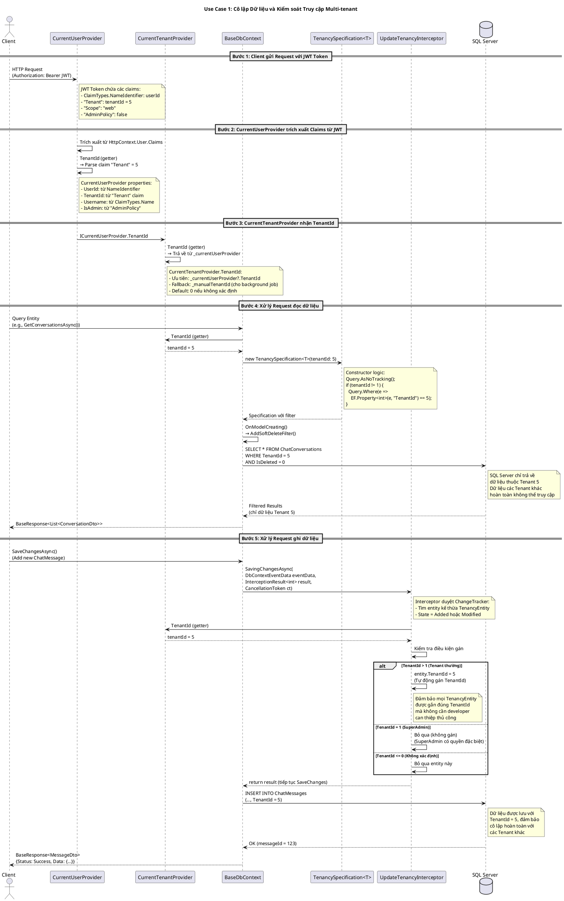
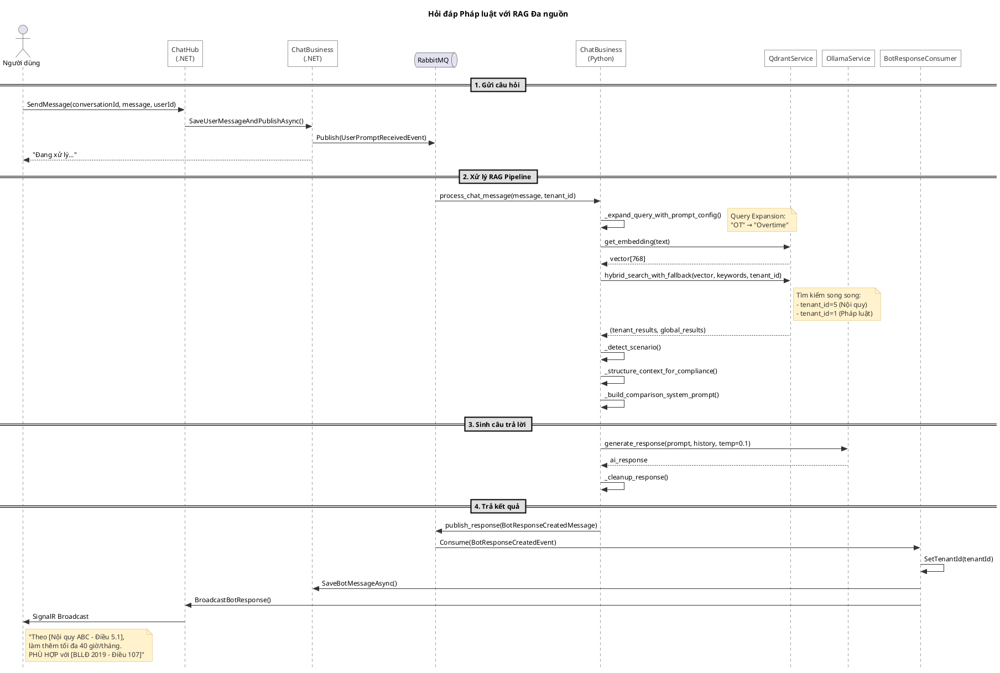

# 4.2.2 Thiết kế lớp (Class Design)

Phần này trình bày chi tiết thiết kế các lớp chủ đạo trong hai luồng xử lý cốt lõi của hệ thống: **Cô lập Multi-tenant** và **RAG (Retrieval-Augmented Generation)**. Mỗi lớp được mô tả với đầy đủ các thuộc tính, phương thức cùng với vai trò cụ thể trong kiến trúc tổng thể.

---

## 4.2.2.1 Luồng Cô lập Multi-tenant

Hệ thống Multi-tenant được thiết kế với mục tiêu đảm bảo dữ liệu của mỗi doanh nghiệp (tenant) được cô lập hoàn toàn, không bị truy cập hoặc ảnh hưởng bởi các tenant khác. Các lớp chủ đạo sau đây đóng vai trò then chốt trong việc thực hiện cơ chế cô lập này.

### A. Lớp CurrentTenantProvider

**Vị trí:** `Infrastructure/Tenancy/CurrentTenantProvider.cs`

**Vai trò:** Đây là lớp trung tâm trong việc xác định và cung cấp thông tin Tenant hiện tại cho toàn bộ hệ thống. Lớp này hỗ trợ hai cơ chế lấy TenantId: từ HTTP Context (JWT claims) và từ gán thủ công (cho các tiến trình nền như RabbitMQ consumer).

| STT | Tên thuộc tính | Kiểu dữ liệu | Vai trò |
|-----|----------------|--------------|---------|
| 1 | _currentUserProvider | ICurrentUserProvider? | Dependency injection để truy xuất TenantId từ JWT token trong HTTP Context. Cho phép null để hỗ trợ các tiến trình không có HTTP Context. |
| 2 | _manualTenantId | int? | Lưu trữ TenantId được gán thủ công, sử dụng cho các tiến trình nền (background job) như RabbitMQ consumer khi không có HTTP request. |

| STT | Tên phương thức | Tham số | Kiểu trả về | Vai trò |
|-----|-----------------|---------|-------------|---------|
| 1 | TenantId (Property Getter) | - | int | Trả về TenantId theo cơ chế hybrid: ưu tiên từ HTTP Context (JWT claims), nếu không có thì fallback về _manualTenantId. Trả về 0 nếu không xác định được. |
| 2 | SetTenantId | int? tenantId | void | Gán TenantId thủ công cho các tiến trình không có HTTP Context. Phương thức này được gọi bởi RabbitMQ consumer để thiết lập tenant context trước khi xử lý message. |

---

### B. Lớp UpdateTenancyInterceptor

**Vị trí:** `Infrastructure/Database/UpdateTenancyInterceptor.cs`

**Vai trò:** Đây là EF Core Interceptor tự động gán TenantId cho tất cả các entity kế thừa từ TenancyEntity trước khi lưu vào database. Đảm bảo mọi dữ liệu đều được đánh dấu đúng tenant mà không cần developer can thiệp thủ công.

| STT | Tên thuộc tính | Kiểu dữ liệu | Vai trò |
|-----|----------------|--------------|---------|
| 1 | _serviceScopeFactory | IServiceScopeFactory | Factory để tạo service scope riêng, cho phép resolve ICurrentTenantProvider trong context của EF Core interceptor (nằm ngoài HTTP request scope). |

| STT | Tên phương thức | Tham số | Kiểu trả về | Vai trò |
|-----|-----------------|---------|-------------|---------|
| 1 | SavingChangesAsync | DbContextEventData eventData, InterceptionResult<int> result, CancellationToken cancellationToken | ValueTask<InterceptionResult<int>> | Được gọi tự động bởi EF Core trước khi SaveChanges. Duyệt qua tất cả entity kiểu TenancyEntity đang được thêm/sửa, tự động gán TenantId từ CurrentTenantProvider. Bỏ qua nếu TenantId = 1 (SuperAdmin) hoặc <= 0. |

---

### C. Lớp TenancyEntity

**Vị trí:** `Infrastructure/Entities/BaseEntity.cs`

**Vai trò:** Đây là abstract class làm base cho tất cả các entity cần cô lập theo tenant. Bất kỳ entity nào kế thừa từ TenancyEntity sẽ tự động được hưởng cơ chế cô lập Multi-tenant thông qua UpdateTenancyInterceptor và TenancySpecification.

| STT | Tên thuộc tính | Kiểu dữ liệu | Vai trò |
|-----|----------------|--------------|---------|
| 1 | Id | int | Khóa chính của entity (kế thừa từ BaseEntity). |
| 2 | CreatedAt | DateTime | Thời điểm tạo bản ghi (kế thừa từ AuditableEntity). |
| 3 | LastModifiedAt | DateTime? | Thời điểm cập nhật gần nhất. |
| 4 | CreatedBy | string? | Username của người tạo bản ghi. |
| 5 | LastModifiedBy | string? | Username của người cập nhật gần nhất. |
| 6 | IsDeleted | bool | Cờ đánh dấu soft-delete, thay vì xóa vật lý. |
| 7 | **TenantId** | int | **Khóa ngoại xác định tenant sở hữu bản ghi. Đây là thuộc tính quan trọng nhất để cô lập dữ liệu Multi-tenant.** |

---

### D. Lớp TenancySpecification<T>

**Vị trí:** `Infrastructure/Specifications/TenancySpecification.cs`

**Vai trò:** Specification pattern sử dụng Ardalis.Specification để tự động filter query theo TenantId. Đảm bảo tất cả các truy vấn đọc dữ liệu đều chỉ trả về bản ghi thuộc tenant hiện tại.

| STT | Tên thuộc tính | Kiểu dữ liệu | Vai trò |
|-----|----------------|--------------|---------|
| 1 | Query | ISpecificationBuilder<T> | Builder để xây dựng điều kiện truy vấn LINQ. |

| STT | Tên phương thức | Tham số | Kiểu trả về | Vai trò |
|-----|-----------------|---------|-------------|---------|
| 1 | Constructor | int tenantId | - | Khởi tạo specification với TenantId cần filter. Nếu tenantId != 1 (SuperAdmin), tự động thêm điều kiện `WHERE TenantId = {tenantId}` vào query. SuperAdmin (TenantId = 1) không bị filter, có thể truy cập dữ liệu của mọi tenant. |

---

### E. Lớp CurrentUserProvider

**Vị trí:** `Infrastructure/Web/CurrentUserProvider.cs`

**Vai trò:** Provider trích xuất thông tin người dùng hiện tại từ JWT claims trong HTTP Context. Lớp này cung cấp TenantId cho CurrentTenantProvider thông qua interface ICurrentUserProvider.

| STT | Tên thuộc tính | Kiểu dữ liệu | Vai trò |
|-----|----------------|--------------|---------|
| 1 | UserId | int | ID người dùng, trích xuất từ ClaimTypes.NameIdentifier trong JWT. |
| 2 | TenantId | int | ID tenant, trích xuất từ claim "Tenant" trong JWT. Đây là nguồn dữ liệu chính cho CurrentTenantProvider. |
| 3 | Username | string | Tên người dùng, trích xuất từ ClaimTypes.Name trong JWT. |
| 4 | Scope | string? | Phạm vi quyền (admin/web), trích xuất từ claim "Scope". |
| 5 | IsAdmin | bool | Cờ xác định quyền admin, trích xuất từ claim "AdminPolicy". |
| 6 | Token | string? | JWT token gốc, lấy từ cookies hoặc Authorization header. |

| STT | Tên phương thức | Tham số | Kiểu trả về | Vai trò |
|-----|-----------------|---------|-------------|---------|
| 1 | Constructor | IHttpContextAccessor httpContextAccessor | - | Khởi tạo provider với HttpContextAccessor để truy cập claims từ JWT token. |

---

### F. Lớp BaseDbContext

**Vị trí:** `Infrastructure/Database/BaseDbContext.cs`

**Vai trò:** Abstract base class cho tất cả DbContext trong hệ thống. Tự động cấu hình Global Query Filter cho soft-delete và áp dụng các IEntityTypeConfiguration.

| STT | Tên thuộc tính | Kiểu dữ liệu | Vai trò |
|-----|----------------|--------------|---------|
| 1 | options | DbContextOptions | Cấu hình connection string và các options cho EF Core. |

| STT | Tên phương thức | Tham số | Kiểu trả về | Vai trò |
|-----|-----------------|---------|-------------|---------|
| 1 | Constructor | DbContextOptions options | - | Khởi tạo DbContext với options. |
| 2 | OnModelCreating | ModelBuilder modelBuilder | void | Override để: (1) Apply tất cả IEntityTypeConfiguration từ assembly, (2) Thêm Global Query Filter `IsDeleted == false` cho mọi AuditableEntity. |
| 3 | AddSoftDeleteFilter | ModelBuilder modelBuilder, Type entityType | void | Private method thêm query filter soft-delete cho một entity type cụ thể. |

---

## 4.2.2.2 Luồng RAG (Retrieval-Augmented Generation)

Luồng RAG là cốt lõi của hệ thống tra cứu và giải đáp luật. Hệ thống kết hợp tìm kiếm ngữ nghĩa (semantic search) với tìm kiếm từ khóa (keyword search) để truy xuất tài liệu liên quan, sau đó sử dụng LLM để sinh câu trả lời dựa trên ngữ cảnh được truy xuất.

### A. Lớp EmbeddingService (Python)

**Vị trí:** `Services/EmbeddingService/src/business.py`

**Vai trò:** Service chịu trách nhiệm chuyển đổi văn bản thành vector embedding và lưu trữ vào Qdrant Vector Database. Đây là thành phần quan trọng trong pipeline Ingest Document.

| STT | Tên thuộc tính | Kiểu dữ liệu | Vai trò |
|-----|----------------|--------------|---------|
| 1 | tokenizer | AutoTokenizer | Tokenizer từ HuggingFace Transformers để phân tách văn bản thành token. |
| 2 | model | AutoModel | Pre-trained Transformer model để sinh embedding vector. |
| 3 | qdrant_client | QdrantClient | Client kết nối đến Qdrant Vector Database để lưu trữ và truy vấn vector. |

| STT | Tên phương thức | Tham số | Kiểu trả về | Vai trò |
|-----|-----------------|---------|-------------|---------|
| 1 | encode_text | text: str | List[float] | Chuyển đổi văn bản đầu vào thành vector embedding bằng cách tokenize, đưa qua model, và áp dụng mean pooling. Vector được normalize L2 để chuẩn hóa độ dài. |
| 2 | mean_pooling | model_output, attention_mask | Tensor | Tính trung bình các token embedding có trọng số attention mask để tạo sentence embedding. |
| 3 | vectorize_and_store | text: str, metadata: dict, collection_name: str | tuple(point_id, vector_size, collection_name) | Tạo embedding cho văn bản và lưu vào Qdrant cùng với metadata (tenant_id, source_id, document_name, heading1, heading2). |
| 4 | vectorize_batch | items: list, collection_name: str | tuple(count, collection_name) | Xử lý batch nhiều văn bản, tạo embedding và lưu hàng loạt vào Qdrant. Tối ưu hiệu năng cho việc ingest tài liệu lớn. |
| 5 | delete_by_filter | source_id: int, tenant_id: int, type: int, collection_name: str | str | Xóa các vector trong Qdrant theo điều kiện filter (source_id, tenant_id, type). Sử dụng khi cần xóa tài liệu đã vectorize. |
| 6 | search_similarity | query: str, tenant_id: int, limit: int, score_threshold: float | List[ScoredPoint] | Tìm kiếm ngữ nghĩa trong Qdrant với filter theo tenant_id. Trả về các document chunks có similarity score cao nhất. |

---

### B. Lớp QdrantService (Python - ChatProcessor)

**Vị trí:** `Services/ChatProcessor/src/business.py`

**Vai trò:** Service trung gian xử lý tìm kiếm vector trong Qdrant, hỗ trợ hybrid search (kết hợp vector search và keyword search) với cơ chế fallback thông minh giữa tài liệu tenant và tài liệu pháp luật chung.

| STT | Tên thuộc tính | Kiểu dữ liệu | Vai trò |
|-----|----------------|--------------|---------|
| 1 | host | str | Địa chỉ host của Qdrant server. |
| 2 | port | int | Port kết nối đến Qdrant. |
| 3 | collection_name | str | Tên collection mặc định trong Qdrant. |
| 4 | client | AsyncQdrantClient | Async client để thực hiện các thao tác với Qdrant. |

| STT | Tên phương thức | Tham số | Kiểu trả về | Vai trò |
|-----|-----------------|---------|-------------|---------|
| 1 | search_with_tenant_filter | query_vector: List[float], tenant_id: int, limit: int | List[ScoredPoint] | Tìm kiếm vector với filter cho phép kết quả từ tenant hiện tại HOẶC tenant 1 (pháp luật chung). Áp dụng similarity threshold để loại bỏ kết quả không liên quan. |
| 2 | search_exact_tenant | query_vector: List[float], tenant_id: int, limit: int | List[ScoredPoint] | Tìm kiếm chỉ trong phạm vi một tenant cụ thể (không fallback). |
| 3 | get_embedding | text: str | List[float] | Gọi EmbeddingService qua HTTP để lấy embedding vector cho query text. |
| 4 | search_with_keywords | query_vector: List[float], keywords: List[str], tenant_id: int, limit: int | List[ScoredPoint] | Hybrid search: kết hợp vector similarity với keyword matching trên các trường text, document_name, heading1, heading2. |
| 5 | hybrid_search_single_tenant | query_vector: List[float], keywords: List[str], tenant_id: int, limit: int | List[ScoredPoint] | Thực hiện hybrid search cho một tenant, kết hợp kết quả vector search và keyword search bằng thuật toán RRF (Reciprocal Rank Fusion). |
| 6 | hybrid_search_with_fallback | query_vector: List[float], keywords: List[str], tenant_id: int, limit: int | tuple(tenant_results, global_results, fallback_triggered) | Tìm kiếm song song trong tài liệu tenant và tài liệu pháp luật chung (tenant_id=1). Áp dụng fallback logic nếu kết quả tenant không đủ. |

---

### C. Lớp ChatBusiness (Python - ChatProcessor)

**Vị trí:** `Services/ChatProcessor/src/business.py`

**Vai trò:** Lớp orchestration chính của pipeline RAG, điều phối toàn bộ luồng xử lý từ nhận câu hỏi, mở rộng truy vấn, tìm kiếm tài liệu, đến sinh câu trả lời từ LLM.

| STT | Tên phương thức | Tham số | Kiểu trả về | Vai trò |
|-----|-----------------|---------|-------------|---------|
| 1 | process_chat_message | conversation_id: int, user_id: int, message: str, tenant_id: int, ollama_service: OllamaService, qdrant_service: QdrantService, system_instruction: List[Dict], system_prompt: str | Dict[str, Any] | **Phương thức chính của pipeline RAG.** Thực hiện: (1) Query expansion với prompt_config, (2) Trích xuất từ khóa pháp lý, (3) Hybrid search với fallback, (4) Xây dựng context có cấu trúc, (5) Sinh câu trả lời từ LLM, (6) Post-processing cleanup. |
| 2 | _expand_query_with_prompt_config | raw_message: str, prompt_config: List[Dict[str, str]] | str | Mở rộng query bằng cách thay thế các từ viết tắt/thuật ngữ bằng mô tả đầy đủ. Ví dụ: "OT" → "Overtime Payment". |
| 3 | _detect_scenario | company_rule_results: list, legal_base_results: list, system_prompt: str | str | Xác định kịch bản dựa trên kết quả tìm kiếm: "BOTH" (cả nội quy và luật), "COMPANY_ONLY", "LEGAL_ONLY", "STATIC_CONTEXT" (chỉ có system prompt), "NONE". |
| 4 | _build_comparison_system_prompt | fallback_mode: bool | str | Tạo system prompt cho chế độ SO SÁNH khi có cả nội quy công ty và văn bản pháp luật. Bao gồm các ràng buộc nghiêm ngặt về định dạng và độ dài câu trả lời. |
| 5 | _build_single_source_system_prompt | fallback_mode: bool | str | Tạo system prompt nhẹ cho chế độ nguồn đơn (chỉ nội quy HOẶC chỉ luật). |
| 6 | _build_citation_label | result: ScoredPoint, is_company_rule: bool, index: int | str | Xây dựng nhãn trích dẫn từ metadata Qdrant. Định dạng: "[Tên tài liệu - Điều X, Khoản Y]". |
| 7 | _structure_context_for_compliance | company_rule_results: list, legal_base_results: list, tenant_id: int, scenario: str | tuple(context_string, source_ids, documents_count) | Cấu trúc hóa các document chunks thành context string có phân nhóm rõ ràng: NỘI QUY CÔNG TY và VĂN BẢN PHÁP LUẬT. |
| 8 | _cleanup_response | response: str | str | Post-processing: loại bỏ các prefix không mong muốn ("Trả lời:", "Bước 1:", ...) và các bước suy luận chain-of-thought khỏi câu trả lời. |

---

### D. Lớp OllamaService (Python - ChatProcessor)

**Vị trí:** `Services/ChatProcessor/src/business.py`

**Vai trò:** Service wrapper để tương tác với Ollama LLM server, thực hiện việc sinh câu trả lời dựa trên context được cung cấp.

| STT | Tên thuộc tính | Kiểu dữ liệu | Vai trò |
|-----|----------------|--------------|---------|
| 1 | base_url | str | URL của Ollama server. |
| 2 | model | str | Tên model LLM được sử dụng (ví dụ: "vistral"). |
| 3 | timeout | int | Timeout (giây) cho các request đến Ollama. |
| 4 | chat_endpoint | str | Endpoint đầy đủ cho API chat của Ollama. |

| STT | Tên phương thức | Tham số | Kiểu trả về | Vai trò |
|-----|-----------------|---------|-------------|---------|
| 1 | generate_response | prompt: str, conversation_history: List[Dict[str, str]], stream: bool, temperature: float | str | Gửi prompt đến Ollama LLM và nhận câu trả lời. Hỗ trợ conversation history để duy trì ngữ cảnh hội thoại. Tham số temperature điều chỉnh độ sáng tạo (thấp = ít hallucination). |
| 2 | list_models | - | list | Liệt kê các model đang có sẵn trên Ollama server. |
| 3 | health_check | - | bool | Kiểm tra trạng thái kết nối đến Ollama server và xác minh model đã được cài đặt. |

---

### E. Lớp RabbitMQService (Python - ChatProcessor)

**Vị trí:** `Services/ChatProcessor/src/consumer.py`

**Vai trò:** Service xử lý kết nối và giao tiếp với RabbitMQ message broker. Chịu trách nhiệm consume message từ queue input (UserPromptReceivedEvent) và publish response đến queue output (BotResponseCreatedEvent).

| STT | Tên thuộc tính | Kiểu dữ liệu | Vai trò |
|-----|----------------|--------------|---------|
| 1 | host | str | Địa chỉ host của RabbitMQ server. |
| 2 | port | int | Port kết nối đến RabbitMQ. |
| 3 | username | str | Username xác thực RabbitMQ. |
| 4 | password | str | Password xác thực RabbitMQ. |
| 5 | input_queue_name | str | Tên queue nhận message từ .NET (UserPromptReceived). |
| 6 | output_queue_name | str | Tên queue gửi response về .NET (BotResponseCreated). |
| 7 | prefetch_count | int | Số lượng message tối đa được prefetch để xử lý song song. |
| 8 | connection | AbstractConnection? | Connection instance đến RabbitMQ. |
| 9 | channel | AbstractChannel? | Channel instance cho việc publish/consume. |

| STT | Tên phương thức | Tham số | Kiểu trả về | Vai trò |
|-----|-----------------|---------|-------------|---------|
| 1 | connect | - | None | Thiết lập connection và channel đến RabbitMQ server. Declare các queue cần thiết. |
| 2 | disconnect | - | None | Đóng connection và giải phóng tài nguyên. |
| 3 | consume_messages | message_handler: Callable[[UserPromptReceivedMessage], Awaitable[None]] | None | Bắt đầu consume message từ input queue. Mỗi message được xử lý bởi callback handler. |
| 4 | publish_response | response: BotResponseCreatedMessage | None | Publish response message đến output queue sau khi xử lý xong. |
| 5 | health_check | - | bool | Kiểm tra trạng thái kết nối đến RabbitMQ server. |

---

### F. Lớp ChatHub (.NET - SignalR)

**Vị trí:** `Services/ChatService/Hubs/ChatHub.cs`

**Vai trò:** SignalR Hub xử lý giao tiếp realtime giữa client và server. Cho phép người dùng gửi tin nhắn và nhận phản hồi từ bot qua WebSocket connection.

| STT | Tên thuộc tính | Kiểu dữ liệu | Vai trò |
|-----|----------------|--------------|---------|
| 1 | _chatBusiness | ChatBusiness | Business logic xử lý chat, lưu message và publish event. |
| 2 | _logger | ILogger<ChatHub> | Logger để ghi log các sự kiện SignalR. |

| STT | Tên phương thức | Tham số | Kiểu trả về | Vai trò |
|-----|-----------------|---------|-------------|---------|
| 1 | SendMessage | int conversationId, string message, int userId | Task | Xử lý tin nhắn từ client: (1) Lưu message vào DB, (2) Publish UserPromptReceivedEvent đến RabbitMQ. |
| 2 | JoinConversation | int conversationId | Task | Thêm client vào SignalR group theo conversationId để nhận broadcast. |
| 3 | LeaveConversation | int conversationId | Task | Xóa client khỏi SignalR group khi rời conversation. |
| 4 | OnConnectedAsync | - | Task | Override xử lý khi client kết nối WebSocket. |
| 5 | OnDisconnectedAsync | Exception? exception | Task | Override xử lý khi client ngắt kết nối. |
| 6 | BroadcastBotResponse (static) | IHubContext<ChatHub> hubContext, int conversationId, object messageDto | Task | Static method broadcast response từ bot đến tất cả client trong group. |

---

### G. Lớp BotResponseConsumer (.NET - MassTransit)

**Vị trí:** `Services/ChatService/Consumers/BotResponseConsumer.cs`

**Vai trò:** MassTransit consumer xử lý BotResponseCreatedEvent từ RabbitMQ. Lưu response của bot vào database và broadcast đến client qua SignalR.

| STT | Tên thuộc tính | Kiểu dữ liệu | Vai trò |
|-----|----------------|--------------|---------|
| 1 | _chatBusiness | ChatBusiness | Business logic để lưu bot message vào DB. |
| 2 | _hubContext | IHubContext<ChatHub> | Context để broadcast message qua SignalR. |
| 3 | _currentTenantProvider | ICurrentTenantProvider | Provider để set tenant context cho background process. |
| 4 | _logger | ILogger<BotResponseConsumer> | Logger để ghi log quá trình consume. |

| STT | Tên phương thức | Tham số | Kiểu trả về | Vai trò |
|-----|-----------------|---------|-------------|---------|
| 1 | Consume | ConsumeContext<BotResponseCreatedEvent> context | Task | Xử lý event: (1) Set TenantId từ event, (2) Gọi ChatBusiness.SaveBotMessageAsync(), (3) Broadcast qua ChatHub.BroadcastBotResponse(). |

---

### H. Lớp ChatBusiness (.NET - ChatService)

**Vị trí:** `Services/ChatService/Features/ChatBusiness.cs`

**Vai trò:** Business logic layer xử lý các nghiệp vụ chat phía .NET. Quản lý conversation, message, và tích hợp với RabbitMQ để publish event đến Python ChatProcessor.

| STT | Tên thuộc tính | Kiểu dữ liệu | Vai trò |
|-----|----------------|--------------|---------|
| 1 | _conversationRepo | IRepository<ChatConversation> | Repository quản lý ChatConversation entity. |
| 2 | _messageRepo | IRepository<ChatMessage> | Repository quản lý ChatMessage entity. |
| 3 | _promptConfigRepo | IRepository<PromptConfig> | Repository quản lý cấu hình prompt (key-value expansion). |
| 4 | _feedbackRepo | IRepository<ChatFeedback> | Repository quản lý feedback từ người dùng. |
| 5 | _publishEndpoint | IPublishEndpoint | MassTransit endpoint để publish event đến RabbitMQ. |
| 6 | _currentUserProvider | ICurrentUserProvider | Provider lấy thông tin user/tenant hiện tại. |
| 7 | _systemPromptBusiness | SystemPromptBusiness | Business logic quản lý system prompt. |

| STT | Tên phương thức | Tham số | Kiểu trả về | Vai trò |
|-----|-----------------|---------|-------------|---------|
| 1 | CreateConversationAsync | CreateConversationRequest request | Task<BaseResponse<ConversationDto>> | Tạo conversation mới cho user. |
| 2 | GetConversationsAsync | - | Task<BaseResponse<List<ConversationDto>>> | Lấy danh sách conversation của user hiện tại (filter theo TenantId). |
| 3 | GetConversationByIdAsync | int conversationId | Task<BaseResponse<ConversationDto>> | Lấy chi tiết conversation theo ID. |
| 4 | SaveUserMessageAndPublishAsync | SendMessageRequest request, CancellationToken ct | Task<MessageDto> | Lưu message của user và publish UserPromptReceivedEvent đến RabbitMQ. |
| 5 | SaveBotMessageAsync | BotResponseCreatedEvent botResponse, CancellationToken ct | Task<MessageDto> | Lưu response của bot vào database (được gọi từ BotResponseConsumer). |
| 6 | CountMessage | - | Task<BaseResponse<int>> | Đếm tổng số message trong hệ thống. |

---

## 4.2.2.3 Biểu đồ Trình tự (Sequence Diagrams)

### A. Use Case 1: Cô lập Dữ liệu và Kiểm soát Truy cập (Data Isolation and Access Control)

Biểu đồ sau mô tả cách hệ thống thực thi cơ chế cô lập Multi-tenant trong quá trình xử lý một yêu cầu dữ liệu. Luồng xử lý bao gồm việc xác thực JWT, trích xuất TenantId, áp dụng Global Query Filter, và tự động gán TenantId khi lưu dữ liệu.

**Giải thích chi tiết:**

1. **Trích xuất TenantId từ JWT:** `CurrentUserProvider` trích xuất các claims từ JWT token trong HTTP Context, bao gồm TenantId từ claim "Tenant". Giá trị này được cung cấp cho `CurrentTenantProvider` thông qua interface `ICurrentUserProvider`.

2. **Global Query Filter với TenancySpecification<T>:** Khi đọc dữ liệu, `BaseDbContext` sử dụng `TenancySpecification<T>` để tự động thêm điều kiện `WHERE TenantId = {tenantId}` vào mọi truy vấn đối với các entity kế thừa từ `TenancyEntity`. Nếu `tenantId = 1` (SuperAdmin), filter không được áp dụng.

3. **UpdateTenancyInterceptor tự động gán TenantId:** Khi ghi dữ liệu, `UpdateTenancyInterceptor.SavingChangesAsync()` duyệt qua ChangeTracker, tìm các entity kế thừa `TenancyEntity` có state Added/Modified, và tự động gán `TenantId` từ `CurrentTenantProvider`. Logic đặc biệt bỏ qua nếu TenantId = 1 (SuperAdmin) hoặc <= 0.

---

### B. Use Case 2: Hỏi đáp Pháp luật với RAG Đa nguồn (Legal Q&A with Multi-source RAG)

Biểu đồ sau mô tả luồng xử lý bất đồng bộ của pipeline RAG khi người dùng đặt câu hỏi. Hệ thống tìm kiếm song song trong cả tài liệu nội quy công ty (tenant-specific) và văn bản pháp luật chung (global law - TenantId=1), sau đó kết hợp kết quả bằng thuật toán RRF và sinh câu trả lời từ LLM.

**Giải thích chi tiết:**

1. **Giao tiếp bất đồng bộ qua SignalR và RabbitMQ:** Người dùng gửi câu hỏi qua `ChatHub.SendMessage()`. ChatBusiness (.NET) lưu message và publish `UserPromptReceivedEvent` đến RabbitMQ thông qua MassTransit `_publishEndpoint`.

2. **Query Expansion với ChatBusiness (Python):** `ChatBusiness._expand_query_with_prompt_config()` mở rộng query bằng cách thay thế từ viết tắt (OT, NLĐ, BHXH) bằng mô tả đầy đủ dựa trên `prompt_config` từ database.

3. **Hybrid Search đa nguồn với QdrantService:** `QdrantService.hybrid_search_with_fallback()` thực hiện tìm kiếm song song:
   - `hybrid_search_single_tenant(tenant_id=5)`: Tài liệu riêng của Tenant
   - `hybrid_search_single_tenant(tenant_id=1)`: Văn bản pháp luật chung (Global Law)
   - Trả về `tuple(tenant_results, global_results, fallback_triggered)`

4. **Context Building và Scenario Detection:** `ChatBusiness._detect_scenario()` xác định kịch bản (BOTH/COMPANY_ONLY/LEGAL_ONLY/STATIC_CONTEXT/NONE), sau đó `_structure_context_for_compliance()` cấu trúc hóa kết quả thành context string với trích dẫn nguồn.

5. **LLM Response Generation:** `OllamaService.generate_response()` sinh câu trả lời với `temperature=0.1` (giảm hallucination). Response được xử lý qua `_cleanup_response()` trước khi gửi về.

6. **Broadcast Response:** `BotResponseConsumer.Consume()` nhận event, gọi `SetTenantId()` để thiết lập tenant context cho background process, lưu message qua `ChatBusiness.SaveBotMessageAsync()`, và broadcast qua `ChatHub.BroadcastBotResponse()`.

---

## 4.2.2.4 Tổng kết

Thiết kế lớp của hệ thống Multi-tenant RAG được xây dựng dựa trên các nguyên tắc sau:

1. **Cô lập dữ liệu đa tầng:** TenantId được kiểm soát từ tầng HTTP (JWT claims), tầng business logic (CurrentTenantProvider), đến tầng database (UpdateTenancyInterceptor và TenancySpecification).

2. **Hybrid Search thông minh:** Kết hợp vector similarity search và keyword matching với thuật toán RRF để tăng độ chính xác truy xuất, đặc biệt với các thuật ngữ pháp lý tiếng Việt.

3. **Fallback linh hoạt:** Khi tài liệu nội quy công ty không đủ, hệ thống tự động mở rộng tìm kiếm sang kho văn bản pháp luật chung (tenant_id = 1) để đảm bảo luôn có câu trả lời hữu ích.

4. **Trích dẫn nguồn chính xác:** Metadata được lưu trữ đầy đủ trong Qdrant (document_name, heading1, heading2) cho phép xây dựng nhãn trích dẫn chi tiết đến từng Điều, Khoản.

5. **Kiến trúc Event-driven:** Sử dụng RabbitMQ để tách biệt luồng xử lý realtime (SignalR) và luồng xử lý AI nặng (Python), đảm bảo khả năng mở rộng và độ ổn định của hệ thống.
