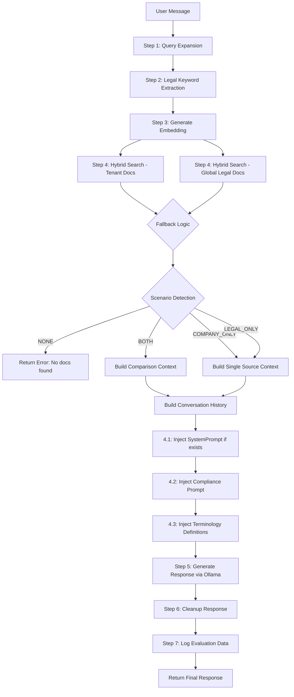
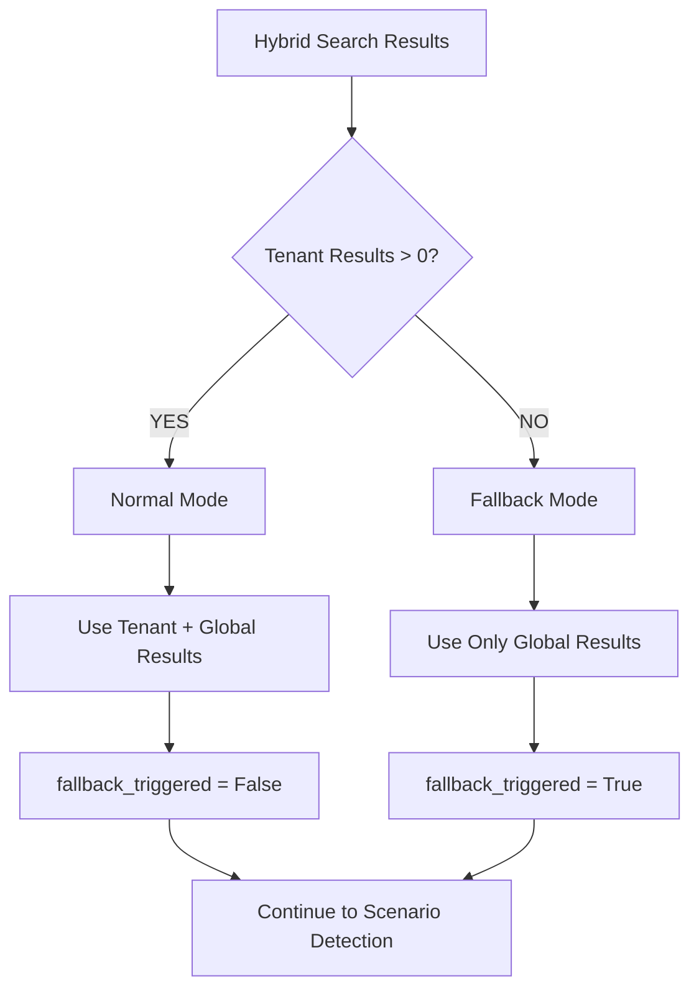
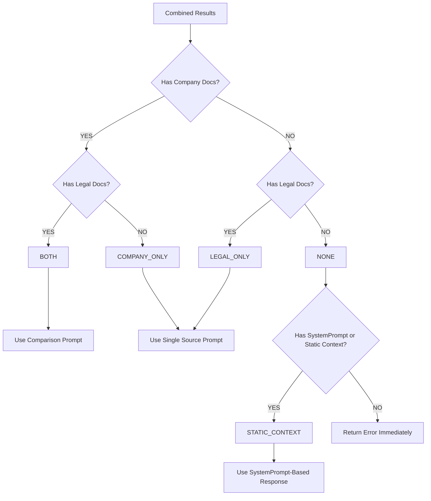

# Logic Hệ Thống RAG - AIChat2025

## 1. Mục Tiêu Cốt Lõi

### Nhiệm Vụ Chính
Hệ thống là một **trợ lý pháp lý AI đa tenant** chuyên về:
- Trả lời câu hỏi về quy định lao động và pháp luật Việt Nam
- So sánh nội quy công ty với văn bản pháp luật nhà nước
- Trích dẫn chính xác từ tài liệu nguồn với metadata đầy đủ

### Persona/Tính Cách
- **Chuyên nghiệp**: Trợ lý pháp lý có kiến thức sâu
- **Ngắn gọn**: Chỉ 2-3 câu, không dài dòng
- **Chính xác**: Không bịa đặt thông tin, trích dẫn đúng nguồn
- **Tuân thủ**: Tuân thủ nghiêm ngặt các ràng buộc về định dạng

### Kiến Trúc Đa Tenant
- **SystemPrompt** (NEW): Hướng dẫn hành vi tùy chỉnh cho từng tenant (persona, tone)
- **PromptConfig**: Định nghĩa thuật ngữ chuyên môn (mapping từ viết tắt → định nghĩa đầy đủ)
- **Tenant Isolation**: Mỗi tenant có knowledge base riêng (tenant_id) + knowledge base chung (tenant_id=1 - pháp luật Việt Nam)

---

## 2. Quy Trình Xử Lý (Processing Workflow)



### Chi Tiết Từng Bước

#### **Step 1: Query Expansion (Mở Rộng Truy Vấn)**
- **File**: `business.py:639-682`
- **Function**: `_expand_query_with_prompt_config()`
- **Logic**:
  1. Nhận `raw_message` và `system_instruction` (PromptConfig)
  2. Tìm các `key` trong message và thay thế bằng `value` (mô tả đầy đủ)
  3. Tạo `enhanced_message` với ngữ nghĩa đầy đủ
- **Ví dụ**:
  - Input: "Tính OT cho nhân viên"
  - PromptConfig: `{"OT": "Overtime Payment - Phụ cấp làm thêm giờ"}`
  - Output: "Tính Overtime Payment - Phụ cấp làm thêm giờ cho nhân viên"

#### **Step 2: Legal Keyword Extraction (Trích Xuất Từ Khóa Pháp Lý)**
- **File**: `hybrid_search.py` (LegalTermExtractor)
- **Logic**:
  1. Phân tích `enhanced_message` để tìm các từ khóa pháp lý
  2. Hỗ trợ pattern matching cho:
     - Điều luật: "Điều 212", "điều 105"
     - Tên văn bản: "BHXH", "Bộ luật lao động"
     - Thuật ngữ pháp lý từ PromptConfig
  3. Trả về danh sách keywords cho BM25 matching
- **Mục đích**: Tăng độ chính xác cho keyword search (BM25)

#### **Step 3: Embedding & Hybrid Retrieval**
- **File**: `business.py:874-888`
- **Logic**:
  1. Tạo vector embedding từ `enhanced_message` (NOT raw message)
  2. Gọi `hybrid_search_with_fallback()` với 2 luồng song song:
     - **Tenant Docs**: `hybrid_search_single_tenant(tenant_id=current_tenant)`
     - **Global Legal Docs**: `hybrid_search_single_tenant(tenant_id=1)`
  3. Mỗi luồng thực hiện:
     - **Vector Search**: Tìm kiếm semantic similarity (threshold ≥ 0.5)
     - **Keyword Search**: Tìm kiếm BM25 với keywords (threshold ≥ 0.6)
     - **RRF Fusion**: Kết hợp 2 kết quả bằng Reciprocal Rank Fusion (k=60)

#### **Step 4: Fallback Logic & Scenario Detection**
- **File**: `business.py:446-451`, `business.py:890-908`
- **Fallback Decision** (`HybridSearchStrategy.apply_fallback_logic()`):
  ```
  IF tenant_results.count > 0:
      fallback = False
      RETURN tenant_results + global_results
  ELSE:
      fallback = True
      RETURN global_results only
  ```
- **Scenario Detection** (`_detect_scenario()`):
  ```
  has_company = len(company_rule_results) > 0
  has_legal = len(legal_base_results) > 0

  IF has_company AND has_legal:
      scenario = "BOTH"  → Use comparison prompt
  ELIF has_company AND NOT has_legal:
      scenario = "COMPANY_ONLY"  → Use single source prompt
  ELIF NOT has_company AND has_legal:
      scenario = "LEGAL_ONLY"  → Use single source prompt
  ELSE:
      scenario = "NONE"  → Return error immediately
  ```

#### **Step 5: Context Structuring**
- **File**: `business.py:760-848`
- **Function**: `_structure_context_for_compliance()`
- **Output Format**:
  ```
  ═══════════════════════════════════════
  **═══ NỘI QUY CÔNG TY ═══**
  (Quy định nội bộ - ưu tiên áp dụng)
  ═══════════════════════════════════════

  [Nội quy: Quy chế lao động - Điều 5 - Mục 2]
  <text content>

  ═══════════════════════════════════════
  **═══ VĂN BẢN PHÁP LUẬT ═══**
  (Quy định của Nhà nước - làm cơ sở đối chiếu)
  ═══════════════════════════════════════

  [Bộ luật lao động 2019 - Điều 212]
  <text content>
  ```

#### **Step 6: Conversation History Building**
- **File**: `business.py:931-965`
- **Thứ tự quan trọng**:
  1. **SystemPrompt** (Behavioral instruction - NEW):
     - Tùy chỉnh theo tenant (persona, tone, style)
     - Inject đầu tiên để thiết lập "base personality"
     - Nullable - chỉ inject nếu tenant đã cấu hình
  2. **Compliance Prompt** (Scenario-based instruction):
     - `_build_comparison_system_prompt()` nếu scenario = "BOTH"
     - `_build_single_source_system_prompt()` nếu scenario khác
     - Bao gồm fallback notice nếu `fallback_mode=True`
  3. **Terminology Definitions** (từ PromptConfig):
     - Format: "THUẬT NGỮ CHUYÊN MÔN:\n- OT: Overtime Payment"
     - Giúp LLM hiểu thuật ngữ chuyên môn trong context
  4. **User Query** (với context từ RAG):
     - Format: "Thông tin tham khảo:\n<context>\n\nCâu hỏi của người dùng: <message>"

#### **Step 7: LLM Generation**
- **File**: `business.py:968-972`
- **Parameters**:
  - `model`: vistral (hoặc cấu hình trong settings)
  - `temperature`: **0.1** (giảm hallucination/creativity)
  - `messages`: Conversation history đã build ở Step 6

#### **Step 8: Response Cleanup**
- **File**: `business.py:567-636`
- **Function**: `_cleanup_response()`
- **Logic**:
  1. **Remove reasoning steps**: Loại bỏ "Bước 1:", "Bước 2:", "Bước 3:"
     - Chiến lược: Chỉ giữ phần sau "Bước X:" cuối cùng
  2. **Remove prefixes**: Loại bỏ các tiền tố như:
     - "Trả lời:", "Câu trả lời:", "Kết luận:", "Dựa trên"
     - "Trích dẫn chính xác từ ngữ cảnh"
  3. **Remove instruction lines**: Xóa dòng hướng dẫn nếu có
- **Mục đích**: Đảm bảo output sạch, chỉ có câu trả lời cuối cùng

#### **Step 9: Evaluation Logging**
- **File**: `business.py:990-1006`
- **Logic**:
  - Log metadata bất đồng bộ (non-blocking) bằng `asyncio.create_task()`
  - Lưu: question, contexts, answer, conversation_id, user_id, tenant_id, timestamp
  - Phục vụ evaluation/metrics cho RAG pipeline

---

## 3. Logic Ra Quyết Định & Phân Nhánh

### 3.1 Fallback Decision Tree



**Fallback Criteria**:
- **Normal Mode**: Tenant có ít nhất 1 document match (score ≥ 0.5)
- **Fallback Mode**: Tenant không có document nào → Chỉ dùng global legal docs

### 3.2 Scenario Detection Tree



**Scenario Mapping**:
| Scenario | Company Docs | Legal Docs | SystemPrompt/Static Context | System Prompt | Expected Output |
|----------|--------------|------------|------------------------------|---------------|-----------------|
| **BOTH** | ✅ | ✅ | N/A | Comparison | So sánh nội quy vs luật |
| **COMPANY_ONLY** | ✅ | ❌ | N/A | Single Source | Chỉ trích dẫn nội quy |
| **LEGAL_ONLY** | ❌ | ✅ | N/A | Single Source | Chỉ trích dẫn luật |
| **STATIC_CONTEXT** | ❌ | ❌ | ✅ | SystemPrompt-Based | Trả lời dựa trên context tĩnh |
| **NONE** | ❌ | ❌ | ❌ | N/A | "Không tìm thấy thông tin" |

### 3.3 System Prompt Selection Logic

```python
IF scenario == "BOTH":
    compliance_prompt = _build_comparison_system_prompt(fallback_mode)
    # Hướng dẫn: So sánh nội quy với luật, đánh giá hợp lệ/cao hơn/thấp hơn
ELIF scenario == "STATIC_CONTEXT":
    compliance_prompt = _build_static_context_system_prompt()
    # Hướng dẫn: Trả lời dựa trên thông tin từ SystemPrompt/Company Context
    # KHÔNG cần trích dẫn tài liệu vì không có RAG documents
    # Chỉ sử dụng kiến thức có sẵn trong SystemPrompt
ELSE:  # COMPANY_ONLY or LEGAL_ONLY
    compliance_prompt = _build_single_source_system_prompt(fallback_mode)
    # Hướng dẫn: Chỉ trích dẫn từ nguồn duy nhất, không so sánh

IF fallback_mode == True:
    compliance_prompt += "\n⚠️ CHẾ ĐỘ FALLBACK: Tự động tìm trong CSDL pháp luật chung"
```

### 3.4 RAG vs Static Context Priority Logic (NEW)

**Quy Tắc Ưu Tiên Khi Qdrant Không Trả Về Kết Quả**:

```python
# Step 1: Thực hiện Hybrid Search
results = hybrid_search_with_fallback(query, tenant_id)

# Step 2: Detect Scenario
scenario = _detect_scenario(results)

# Step 3: Apply Fallback Mechanism
IF scenario == "NONE":
    # Không tìm thấy documents từ RAG
    IF has_system_prompt() OR has_static_company_context():
        # ✅ FALLBACK TO STATIC CONTEXT
        scenario = "STATIC_CONTEXT"
        context = get_system_prompt_or_company_context()
        prompt = _build_static_context_system_prompt()
        # → Trả lời dựa trên SystemPrompt/Company Context
    ELSE:
        # ❌ NO INFORMATION AVAILABLE
        RETURN "Xin lỗi, hệ thống không tìm thấy thông tin chính xác"
```

**Thứ Tự Ưu Tiên Nguồn Dữ Liệu**:
1. **RAG Documents (Highest Priority)**: Nếu có documents từ Qdrant → Sử dụng RAG
2. **Static SystemPrompt/Company Context (Fallback)**: Nếu không có RAG documents → Kiểm tra SystemPrompt
3. **Error Message (Last Resort)**: Nếu không có cả RAG và SystemPrompt → Trả lỗi

**Ví Dụ Static Context**:
- **SystemPrompt**: "Bạn là trợ lý HR của công ty ABC. Công ty ABC chuyên về phần mềm, có 200 nhân viên, văn hóa làm việc linh hoạt."
- **User Query**: "Công ty có bao nhiêu nhân viên?"
- **Response**: "Công ty ABC hiện có 200 nhân viên."
  - ℹ️ Lưu ý: Không có trích dẫn tài liệu vì thông tin đến từ SystemPrompt, không phải RAG documents

### 3.5 Similarity Threshold Logic

**Vector Search** (Semantic Similarity):
```python
SIMILARITY_THRESHOLD = 0.5

filtered_results = [r for r in results if r.score >= 0.5]
```

**Keyword Search** (BM25 + Vector):
```python
KEYWORD_THRESHOLD = 0.6

# Lower threshold vì keyword match có ý nghĩa cao hơn
results = await client.search(
    score_threshold=0.6  # Chỉ giữ kết quả có keyword match tốt
)
```

### 3.6 RRF Fusion Formula

**Reciprocal Rank Fusion** (k=60):
```
RRF_score(doc) = Σ [1 / (k + rank_in_list)]

where:
- k = 60 (constant to reduce impact of high ranks)
- rank_in_list = position of doc in vector_results OR keyword_results
- Final score = sum of scores from all lists containing the doc
```

**Example**:
```
Vector Results: [doc1, doc2, doc3]
Keyword Results: [doc2, doc1, doc4]

doc1: 1/(60+1) + 1/(60+2) ≈ 0.0164 + 0.0161 = 0.0325
doc2: 1/(60+2) + 1/(60+1) ≈ 0.0161 + 0.0164 = 0.0325
doc3: 1/(60+3) ≈ 0.0159
doc4: 1/(60+3) ≈ 0.0159

Final Ranking: [doc1/doc2 (tie), doc3, doc4]
```

---

## 4. Ràng Buộc & Guardrails Quan Trọng

### 4.1 Ràng Buộc Tuyệt Đối (⛔ CẤM)

**KHÔNG BAO GIỜ được in ra**:
- ❌ "Bước 1", "Bước 2", "Bước 3" hoặc bất kỳ quy trình suy luận nào
- ❌ "Trả lời:", "Câu trả lời:", "Kết luận:", "Dựa trên"
- ❌ Các hướng dẫn như "Trích dẫn chính xác từ ngữ cảnh"
- ❌ Giải thích quá trình tư duy hoặc phân tích
- ❌ Trả lời dài dòng (chỉ tối đa 2-3 câu)
- ❌ Nhầm lẫn số liệu (nếu hỏi ca ngày → lấy ca ngày, ca đêm → lấy ca đêm)
- ❌ Cung cấp thông tin tuyệt mật hoặc bịa đặt

### 4.2 Định Dạng Đầu Ra Bắt Buộc (✓ CHỈ IN)

**Comparison Mode (BOTH)**:
```
Theo [Tên tài liệu nội quy - Điều X], công ty quy định [số liệu cụ thể],
[đánh giá: hợp lệ/cao hơn/thấp hơn] mức tối thiểu [số liệu]
quy định tại [Tên tài liệu luật - Điều Y].
```

**Single Source Mode (COMPANY_ONLY / LEGAL_ONLY)**:
```
Theo [Tên tài liệu - Điều X], [nội dung cụ thể].
```

### 4.3 Citation Requirements (Trích Dẫn)

**Yêu cầu**:
- Sao chép **CHÍNH XÁC** tên tài liệu trong ngoặc vuông `[...]` từ "Thông tin tham khảo"
- Không tự bịa tên tài liệu hoặc điều khoản
- Format: `[Document Name - Heading1 - Heading2]`

**Ví dụ**:
```
✅ ĐÚNG: Theo [Quy chế lao động - Điều 5 - Mục 2], ...
❌ SAI: Theo quy chế lao động điều 5, ...
❌ SAI: Theo [Quy chế], ...
```

### 4.4 Data Accuracy Constraints

**Trích xuất số liệu**:
- Phải match chính xác với context (ca ngày vs ca đêm)
- Không làm tròn hoặc ước lượng
- Nếu không có số liệu → Không bịa đặt

**Đánh giá hợp lệ**:
- Chỉ so sánh khi có **BOTH** scenario
- Đánh giá: "hợp lệ" (≥), "cao hơn" (>), "thấp hơn" (<), "không đạt" (<)

### 4.5 Security Guardrails

**Tenant Isolation**:
- Mọi query đều filter theo `tenant_id`
- Vector search: `should=[tenant_id=1, tenant_id=current_tenant]`
- Không bao giờ trả về dữ liệu của tenant khác

**JWT Validation**:
- Validate token trước khi process (file: `main.py:137-147`)
- Nếu token invalid/expired → Bỏ qua message, không trả lời

---

## 5. Hướng Dẫn Tone & Style

### 5.1 Tone (Giọng Điệu)

#### Base Persona (Từ SystemPrompt - Nếu Có)
- **Tùy chỉnh theo tenant**: Mỗi tenant có thể định nghĩa persona riêng
- **Ví dụ**:
  - Tenant A: "Bạn là trợ lý HR thân thiện, giọng điệu gần gũi"
  - Tenant B: "Bạn là chuyên gia pháp lý, giọng điệu formal và chuyên nghiệp"

#### Default Persona (Khi Không Có SystemPrompt)
- **Chuyên nghiệp**: Trợ lý pháp lý có kiến thức sâu
- **Khách quan**: Không thiên vị, chỉ trích dẫn sự thật
- **Tôn trọng**: Không phán xét người dùng hoặc công ty

### 5.2 Style (Phong Cách)

#### Ngắn Gọn (Conciseness)
- **Tối đa 2-3 câu**: Không giải thích dài dòng
- **Đi thẳng vào vấn đề**: Không mở đầu với "Dựa trên thông tin..."
- **Ví dụ**:
  ```
  ✅ ĐÚNG (2 câu):
  Theo [Quy chế lao động - Điều 5], công ty quy định phụ cấp ca đêm là
  40% lương cơ bản, cao hơn mức tối thiểu 30% quy định tại
  [Bộ luật lao động 2019 - Điều 212].

  ❌ SAI (dài dòng):
  Sau khi phân tích tài liệu, tôi nhận thấy rằng công ty của bạn có quy định
  về phụ cấp ca đêm trong Điều 5 của Quy chế lao động. Cụ thể, phụ cấp này
  được quy định là 40% lương cơ bản. So với quy định của nhà nước tại Điều 212
  Bộ luật lao động 2019, mức 30%, thì quy định của công ty cao hơn và hợp lệ.
  ```

#### Chính Xác (Precision)
- **Trích dẫn chính xác**: Copy nguyên văn metadata từ context
- **Số liệu cụ thể**: Không ước lượng hoặc làm tròn
- **Điều khoản đầy đủ**: Bao gồm Document Name, Điều, Khoản, Mục

#### Cấu Trúc (Structure)
- **Single Source**: `Theo [X], [Y].`
- **Comparison**: `Theo [X], công ty quy định [A], [đánh giá] mức [B] tại [Y].`
- **Không thêm kết luận**: Không cần câu "Vì vậy, ...", "Do đó, ..."

### 5.3 Adaptation Rules (Quy Tắc Điều Chỉnh)

#### Fallback Mode Notice
- **Khi fallback_triggered=True**: System prompt tự động thêm:
  ```
  ⚠️ CHẾ ĐỘ FALLBACK:
  Hệ thống đã tự động tìm kiếm trong cơ sở dữ liệu pháp luật chung
  do thiếu thông tin từ nội quy công ty.
  ```
- **LLM Response**: Ưu tiên trích dẫn từ văn bản pháp luật Việt Nam

#### Scenario-Based Wording
| Scenario | Citation Style | Evaluation |
|----------|---------------|------------|
| **BOTH** | [Nội quy] ... [Luật] | "hợp lệ/cao hơn/thấp hơn" |
| **COMPANY_ONLY** | [Nội quy] | Không đánh giá |
| **LEGAL_ONLY** | [Luật] | Không đánh giá |
| **STATIC_CONTEXT** | Không cần trích dẫn | Không đánh giá |

#### Error Handling
- **NONE Scenario (with Static Context)**:
  - Nếu có SystemPrompt hoặc Company Context → Sử dụng STATIC_CONTEXT scenario
  - Trả lời dựa trên thông tin có sẵn trong SystemPrompt
  - Không cần trích dẫn tài liệu (vì không có RAG documents)
- **NONE Scenario (without Static Context)**:
  - "Xin lỗi, hệ thống không tìm thấy thông tin chính xác"
- **No Context**: "Hiện không tìm thấy tài liệu tham khảo liên quan"
- **Token Invalid**: Bỏ qua message, không trả lời (silent fail)

---

## 6. Bảng Tra Cứu Nhanh (Quick Reference)

### 6.1 Thresholds & Parameters

| Parameter | Value | Purpose |
|-----------|-------|---------|
| Vector Similarity Threshold | 0.5 | Filter semantic search results |
| Keyword Similarity Threshold | 0.6 | Filter BM25 search results |
| RRF Constant (k) | 60 | Reciprocal Rank Fusion parameter |
| Temperature | 0.1 | Reduce LLM hallucination |
| Max Response Length | 2-3 câu | Enforce conciseness |
| Global Tenant ID | 1 | Legal knowledge base (pháp luật VN) |

### 6.2 Scenario Mapping

| Company Docs | Legal Docs | Static Context | Scenario | Prompt Type | Output Style |
|--------------|------------|----------------|----------|-------------|--------------|
| ✅ | ✅ | N/A | BOTH | Comparison | So sánh + đánh giá |
| ✅ | ❌ | N/A | COMPANY_ONLY | Single Source | Chỉ nội quy |
| ❌ | ✅ | N/A | LEGAL_ONLY | Single Source | Chỉ luật |
| ❌ | ❌ | ✅ | STATIC_CONTEXT | SystemPrompt-Based | Trả lời từ context tĩnh |
| ❌ | ❌ | ❌ | NONE | N/A | Error message |

### 6.3 Conversation History Order

| Order | Component | Source | Required? |
|-------|-----------|--------|-----------|
| 1 | SystemPrompt | Tenant config (DB) | Optional |
| 2 | Compliance Prompt | Scenario-based generation | Required |
| 3 | Terminology Definitions | PromptConfig (DB) | Optional |
| 4 | User Query + Context | RAG retrieval | Required |

### 6.4 Key Functions

| Function | File | Line | Purpose |
|----------|------|------|---------|
| `_expand_query_with_prompt_config()` | business.py | 639-682 | Query expansion (Step 1) |
| `hybrid_search_with_fallback()` | business.py | 395-468 | Hybrid search + fallback |
| `_detect_scenario()` | business.py | 473-497 | Scenario detection |
| `_build_comparison_system_prompt()` | business.py | 500-537 | Comparison prompt |
| `_build_single_source_system_prompt()` | business.py | 540-564 | Single source prompt |
| `_structure_context_for_compliance()` | business.py | 760-848 | Context formatting |
| `_cleanup_response()` | business.py | 567-636 | Post-processing |

---

## 7. Ví Dụ Minh Họa

### Ví Dụ 1: BOTH Scenario (Comparison Mode)

**Input**:
- User: "Phụ cấp ca đêm của công ty có hợp lệ không?"
- PromptConfig: `{"ca đêm": "Ca làm việc từ 22h đến 6h sáng"}`
- Tenant có nội quy: "Điều 5 - Phụ cấp ca đêm: 40%"
- Legal doc: "Điều 212 - Phụ cấp ca đêm tối thiểu: 30%"

**Processing**:
1. Query Expansion: "Phụ cấp Ca làm việc từ 22h đến 6h sáng của công ty có hợp lệ không?"
2. Keywords: ["ca đêm", "phụ cấp", "điều 212"]
3. Hybrid Search: Tìm được cả nội quy và luật
4. Scenario: **BOTH**
5. System Prompt: Comparison mode

**Output**:
```
Theo [Quy chế lao động - Điều 5], công ty quy định phụ cấp ca đêm là 40% lương cơ bản,
cao hơn mức tối thiểu 30% quy định tại [Bộ luật lao động 2019 - Điều 212].
```

### Ví Dụ 2: COMPANY_ONLY Scenario

**Input**:
- User: "Ngày nghỉ phép năm là bao nhiêu?"
- Tenant có nội quy: "Điều 8 - Ngày phép năm: 15 ngày"
- Legal doc: Không tìm thấy (không có trong global knowledge base)

**Processing**:
1. Query Expansion: "Ngày nghỉ phép năm là bao nhiêu?"
2. Keywords: ["ngày phép", "nghỉ phép năm"]
3. Hybrid Search: Chỉ tìm được nội quy, không có luật
4. Scenario: **COMPANY_ONLY**
5. System Prompt: Single Source mode

**Output**:
```
Theo [Quy chế lao động - Điều 8], công ty quy định số ngày phép năm là 15 ngày.
```

### Ví Dụ 3: NONE Scenario (No Documents - No Static Context)

**Input**:
- User: "Chính sách chăm sóc thú cưng tại văn phòng?"
- Không tìm thấy bất kỳ tài liệu nào
- Không có SystemPrompt hoặc Company Context

**Processing**:
1. Hybrid Search: 0 results
2. Scenario: **NONE**
3. Check for SystemPrompt/Static Context: **Không có**
4. Return error immediately (không gọi LLM)

**Output**:
```
Xin lỗi, hệ thống không tìm thấy thông tin chính xác
```

### Ví Dụ 4: STATIC_CONTEXT Scenario (No RAG Documents but Has SystemPrompt)

**Input**:
- User: "Công ty có bao nhiêu nhân viên?"
- Không tìm thấy tài liệu liên quan từ Qdrant
- **SystemPrompt có sẵn**: "Bạn là trợ lý HR của công ty ABC. Công ty ABC là công ty công nghệ chuyên về phát triển phần mềm, có 200 nhân viên, văn hóa làm việc linh hoạt với chính sách work-from-home."

**Processing**:
1. Hybrid Search: 0 results (không tìm thấy documents)
2. Initial Scenario: **NONE**
3. Check for SystemPrompt/Static Context: **Có SystemPrompt**
4. Fallback to: **STATIC_CONTEXT**
5. System Prompt: `_build_static_context_system_prompt()`
6. Context: Sử dụng thông tin từ SystemPrompt

**Output**:
```
Công ty ABC hiện có 200 nhân viên.
```
**Note**: Không có trích dẫn tài liệu vì thông tin đến từ SystemPrompt, không phải từ RAG documents.

### Ví Dụ 5: STATIC_CONTEXT Scenario (General Company Information)

**Input**:
- User: "Văn hóa làm việc của công ty như thế nào?"
- Không tìm thấy tài liệu chính thức từ Qdrant
- **SystemPrompt có sẵn**: "Công ty XYZ có văn hóa cởi mở, khuyến khích sáng tạo, làm việc theo nhóm, và đề cao sự tôn trọng lẫn nhau."

**Processing**:
1. Hybrid Search: 0 results
2. Initial Scenario: **NONE**
3. Check for SystemPrompt/Static Context: **Có SystemPrompt**
4. Fallback to: **STATIC_CONTEXT**

**Output**:
```
Công ty XYZ có văn hóa cởi mở, khuyến khích sáng tạo và làm việc theo nhóm, đồng thời đề cao sự tôn trọng lẫn nhau.
```

### Ví Dụ 6: Fallback Mode (Tenant Docs Insufficient)

**Input**:
- User: "Thời gian thử việc tối đa là bao nhiêu?"
- Tenant không có nội quy về thử việc
- Legal doc: "Điều 24 - Thời gian thử việc tối đa: 60 ngày"

**Processing**:
1. Hybrid Search: 0 tenant results, 1 global result
2. Fallback: **Triggered** (fallback_mode=True)
3. Scenario: **LEGAL_ONLY**
4. System Prompt: Single Source + Fallback notice

**Output**:
```
Theo [Bộ luật lao động 2019 - Điều 24], thời gian thử việc tối đa là 60 ngày.
```

---

## 8. Monitoring & Evaluation

### 8.1 Logging Metrics

**Logged Data** (file: `business.py:990-1006`):
- Question (raw user message)
- Contexts (retrieved document texts)
- Answer (final cleaned response)
- Conversation ID, User ID, Tenant ID
- Timestamp

**Purpose**:
- Đánh giá chất lượng RAG (Retrieval quality)
- Phát hiện hallucination
- Optimize prompt engineering

### 8.2 Debug Fields

**Response Metadata**:
```python
{
    'scenario': str,  # BOTH, COMPANY_ONLY, LEGAL_ONLY, NONE
    'fallback_triggered': bool,  # True nếu fallback mode
    'rag_documents_used': int,  # Số lượng documents sử dụng
    'source_ids': List[int],  # IDs của documents
}
```

---

## Tóm Tắt Nguyên Tắc Hoạt Động

1. **Query Enhancement**: Luôn mở rộng query bằng PromptConfig trước khi embedding
2. **Hybrid Search**: Kết hợp vector (semantic) + keyword (BM25) với RRF fusion
3. **Intelligent Fallback**: Tự động chuyển sang legal knowledge base nếu tenant docs không đủ
4. **RAG vs Static Context Priority** (NEW):
   - **Ưu tiên 1**: Sử dụng RAG documents nếu Qdrant tìm thấy kết quả
   - **Ưu tiên 2**: Fallback sang SystemPrompt/Company Context nếu không có RAG documents
   - **Ưu tiên 3**: Trả lỗi nếu không có cả RAG documents và SystemPrompt
5. **Scenario-Based Prompting**: Chọn system prompt phù hợp với loại tài liệu tìm được (BOTH, COMPANY_ONLY, LEGAL_ONLY, STATIC_CONTEXT, NONE)
6. **Multi-Layer System Prompt**: SystemPrompt → Compliance → Terminology
7. **Low Temperature**: Temperature=0.1 để giảm hallucination
8. **Aggressive Cleanup**: Post-processing để loại bỏ reasoning steps và prefixes
9. **Strict Citation**: Trích dẫn chính xác metadata từ retrieved documents (trừ STATIC_CONTEXT scenario)
10. **Concise Output**: Tối đa 2-3 câu, không giải thích dài dòng
11. **Tenant Isolation**: Mọi operation đều filter theo tenant_id để đảm bảo security

---

**Tài liệu này mô tả logic hệ thống RAG tại thời điểm 2026-01-03. Để cập nhật, vui lòng tham khảo source code tại `Services/ChatProcessor/src/business.py`.**
