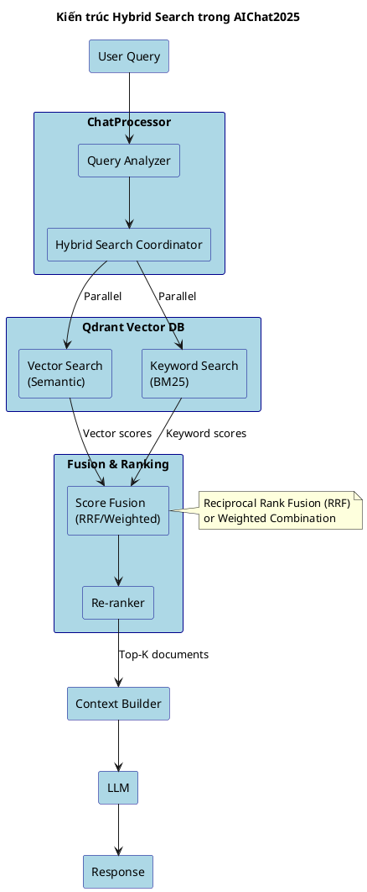

# PROMPT 4: Review Template & Update Diagrams Specifications

## Context
- All chapter outlines have been reviewed and updated
- Hybrid search has been integrated into the appropriate chapters
- Now we need to review the LaTeX template and update diagram specifications

## Your Task - Part A: Review Template Diagrams

### Step 1: Scan Template Folder
Explore the folder: `/SOICT_DATN_Application_VIE_Template/`

Look for:
- Main thesis file (DoAn.tex or similar)
- Chapter files in `/Chuong/` folder
- Images/diagrams in `/Hinhve/` folder
- Any example diagrams or templates

### Step 2: Analyze Existing Diagrams
In the `/Hinhve/` folder, examine what diagrams/images are already there:

- List all files
- Identify what type of diagrams they are (architecture, use case, ER diagram, etc.)
- Determine if they are:
  - ✅ Example/template diagrams
  - ⚠️ Placeholder diagrams
  - ❌ Irrelevant images

### Step 3: Review Template Chapter 4 Requirements
Read the template's Chapter 4 file to understand what diagrams are expected:

From `/Chuong/4_Ket_qua_thuc_nghiem.tex`:
- What diagrams are referenced?
- What diagram placeholders exist?
- What diagram types are recommended?

### Step 4: Create Template Diagrams Analysis

Create file: `thesis_docs/template_diagrams_analysis.md`

```markdown
# Template Diagrams Analysis

## Existing Diagrams in /Hinhve/

| File Name | Type | Purpose | Status | Action Needed |
|-----------|------|---------|--------|---------------|
| Bia.PNG | Cover image | Thesis cover | Template | Keep as-is |
| Picture1.png | [Type] | [Purpose] | [Template/Example/Placeholder] | [Keep/Replace/Remove] |
| ... | ... | ... | ... | ... |

## Template Requirements from Chapter Files

### Chapter 1 Requirements
- [ ] Diagram X: [Description]

### Chapter 2 Requirements
- [ ] Use case diagram: Overview
- [ ] Activity diagrams: Main flows
- [ ] ...

### Chapter 3 Requirements
- [ ] Technology stack diagram
- [ ] ...

### Chapter 4 Requirements (MOST IMPORTANT)
- [ ] System architecture diagram (high-level)
- [ ] Component diagram
- [ ] Sequence diagrams (2-3 main flows)
- [ ] Class diagrams (2-4 modules)
- [ ] ER diagram
- [ ] UI mockups/wireframes
- [ ] Deployment diagram
- [ ] ...

### Chapter 5 Requirements
[If any diagrams are mentioned in template]

---

## Gap Analysis

### Diagrams We Need to Create (Not in Template)
1. Multi-tenant architecture diagram
2. Dual-RAG pipeline flowchart
3. Hybrid search architecture
4. JWT authentication sequence
5. Document embedding pipeline
6. ...

### Template Diagrams We Can Adapt
1. [Diagram name]: Can be used as base for [our diagram]
2. ...

### Template Diagrams We Should Remove
1. [Diagram name]: Not relevant to our project
```

---

## Your Task - Part B: Update Diagrams Specification

### Step 5: Review Current Diagrams List
Read: `thesis_docs/diagrams_to_create.md`

This file was created earlier with all diagrams needed for the thesis.

### Step 6: Update Diagrams List Based on:
1. **Template requirements** (from Part A)
2. **Hybrid search addition** (new diagrams needed)
3. **Chapter outline updates** (any new diagrams mentioned)

### Step 7: Create Updated Diagrams Specification

Update file: `thesis_docs/diagrams_to_create.md`

Add/modify sections as needed:

```markdown
# Diagrams to Create for AIChat2025 Thesis

---

## ✅ NEW/UPDATED: Hybrid Search Diagrams

### [NEW] Hybrid Search Architecture
- **Type:** Architecture diagram (boxes and arrows)
- **Tool:** PlantUML
- **Priority:** HIGH
- **Chapter:** 4.1.3 (if in Chapter 4) OR 5.X.2 (if in Chapter 5)
- **Content:**
  - Vector search component (Qdrant)
  - Keyword search component (BM25)
  - Fusion/ranking layer
  - Data flow from query to results
- **PlantUML file:** `diagrams/hybrid_search_architecture.puml`

### [NEW] Hybrid Search Sequence Diagram
- **Type:** UML Sequence Diagram
- **Tool:** PlantUML
- **Priority:** MEDIUM
- **Chapter:** 4.2.2 or 5.X.2
- **Content:**
  - User query input
  - Parallel vector + keyword search
  - Score fusion
  - Re-ranking
  - Response generation
- **PlantUML file:** `diagrams/hybrid_search_sequence.puml`

---

## 📊 Updated: RAG Pipeline Diagrams

### [UPDATED] RAG Pipeline Flowchart
- **Changes:** Add hybrid search step
- **Original location:** diagrams/rag_pipeline_sequence.puml
- **Updates needed:**
  - Add "Hybrid Retrieval" box
  - Show dual retrieval paths (vector + keyword)
  - Add fusion step

---

## 🎨 Template-Aligned Diagrams

### From Template Requirements

[List diagrams that match template requirements]

---

## 📋 Complete Diagrams Checklist

### Chapter 1: Giới thiệu
- [ ] 1. Use Case Overview - `diagrams/use_case_overview.puml` - HIGH
- [ ] ...

### Chapter 2: Khảo sát
- [ ] 3. Activity Diagram - Chat Flow - `diagrams/activity_chat_flow.puml` - HIGH
- [ ] ...

### Chapter 3: Công nghệ
- [ ] 7. Technology Stack - `diagrams/tech_stack.puml` - MEDIUM
- [ ] ...

### Chapter 4: Thiết kế & Triển khai
- [ ] 10. System Architecture (C4 Context) - `diagrams/system_arch_context.puml` - HIGH
- [ ] 11. System Architecture (C4 Container) - `diagrams/system_arch_container.puml` - HIGH
- [ ] 12. Multi-tenant Data Flow - `diagrams/multitenant_flow.puml` - HIGH
- [ ] **13. [NEW] Hybrid Search Architecture** - `diagrams/hybrid_search_architecture.puml` - HIGH
- [ ] 14. RAG Pipeline (UPDATED) - `diagrams/rag_pipeline.puml` - HIGH
- [ ] 15. Authentication Sequence - `diagrams/auth_sequence.puml` - HIGH
- [ ] 16. Document Embedding Sequence - `diagrams/doc_embedding_sequence.puml` - MEDIUM
- [ ] 17. Class Diagram - Auth Module - `diagrams/class_auth.puml` - HIGH
- [ ] 18. Class Diagram - Document Module - `diagrams/class_document.puml` - MEDIUM
- [ ] 19. Class Diagram - Chat Module - `diagrams/class_chat.puml` - HIGH
- [ ] 20. Class Diagram - Tenant Module - `diagrams/class_tenant.puml` - MEDIUM
- [ ] 21. Database ER Diagram - `diagrams/database_er.puml` - HIGH
- [ ] 22. Deployment Diagram - `diagrams/deployment.puml` - HIGH
- [ ] **23. [NEW] Hybrid Search Sequence** - `diagrams/hybrid_search_sequence.puml` - MEDIUM
- [ ] 24. UI Wireframes - Chat Interface - [Figma/Manual] - HIGH
- [ ] 25. UI Wireframes - Admin Dashboard - [Figma/Manual] - MEDIUM
- [ ] ...

### Chapter 5: Giải pháp
- [ ] [If hybrid search is in Chapter 5, diagrams are already listed above]
- [ ] ...

---

## 🚀 Next Steps

### Immediate (Do Now)
1. Create hybrid search architecture diagram (PlantUML)
2. Update RAG pipeline diagram
3. Create/update 3 most critical diagrams for Chapter 4

### Soon (This Week)
4-10. [Other HIGH priority diagrams]

### Later (Next Week)
11+. [MEDIUM and LOW priority diagrams]

---

## 📝 PlantUML Templates Needed

List which diagram templates should be created immediately:
1. `diagrams/hybrid_search_architecture.puml` ⭐ NEW
2. `diagrams/hybrid_search_sequence.puml` ⭐ NEW  
3. `diagrams/rag_pipeline.puml` ⭐ UPDATE
4. ...
```

### Step 8: Create PlantUML Templates for Priority Diagrams

Create the most critical PlantUML diagram templates:

#### Priority 1: Hybrid Search Architecture
Create file: `thesis_docs/diagrams/hybrid_search_architecture.puml`



#### Priority 2: Update RAG Pipeline

Update file: `thesis_docs/diagrams/rag_pipeline_sequence.puml`
(Add hybrid search steps to existing diagram)

---

## Expected Output Files

### Part A: Template Analysis
1. `thesis_docs/template_diagrams_analysis.md` - Analysis of template diagrams

### Part B: Updated Specifications
2. `thesis_docs/diagrams_to_create.md` - UPDATED with hybrid search and template requirements
3. `thesis_docs/diagrams/hybrid_search_architecture.puml` - NEW PlantUML template
4. `thesis_docs/diagrams/hybrid_search_sequence.puml` - NEW PlantUML template
5. `thesis_docs/diagrams/rag_pipeline.puml` - UPDATED PlantUML template

---

## Final Summary

After completing this prompt, you should have:
- ✅ Complete understanding of template diagram requirements
- ✅ Updated diagrams list including hybrid search
- ✅ PlantUML templates for critical diagrams
- ✅ Clear roadmap for creating remaining diagrams

**This completes the 4-prompt workflow! 🎉**
