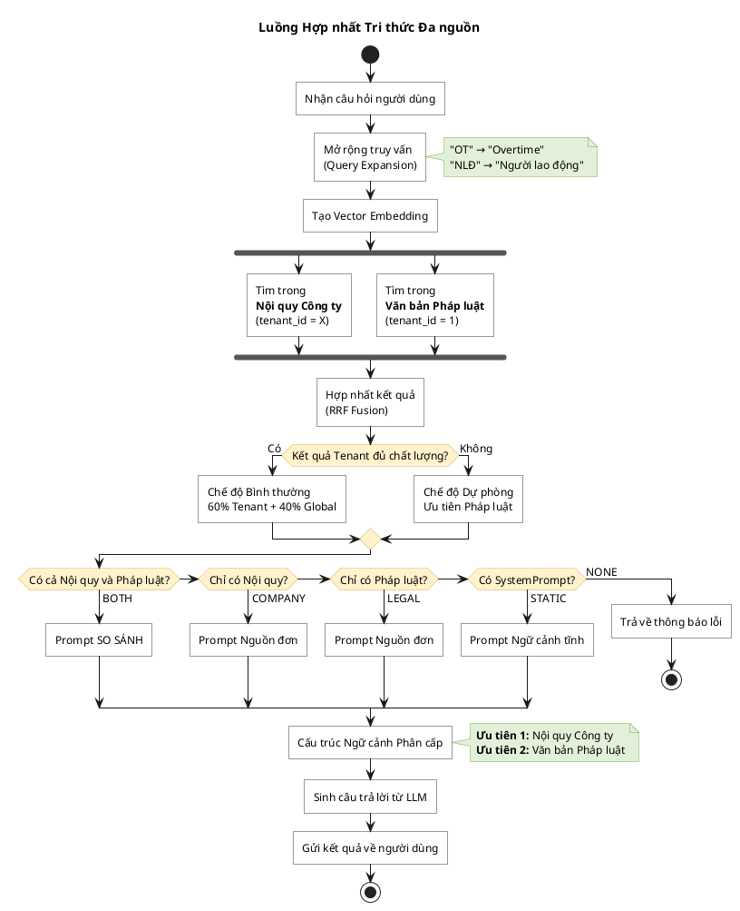

# 5.2.2 Cơ chế Hợp nhất Tri thức Đa nguồn và Phân cấp Ngữ cảnh

## Giới thiệu

Trong hệ thống Multi-tenant RAG tra cứu pháp luật, thông tin liên quan đến một câu hỏi có thể nằm rải rác ở nhiều nguồn: Nội quy công ty (Tenant Data) và Văn bản pháp luật quốc gia (Global Data). Mục này trình bày giải pháp hợp nhất tri thức đa nguồn thông qua ba cơ chế chính.

---

## 5.2.2.1 Nguyên lý Lọc Đa nguồn trên Qdrant

### Mô hình Phân vùng Dữ liệu

Hệ thống áp dụng mô hình **Dual-Tenant** để phân biệt hai loại tri thức:

| TenantId | Loại dữ liệu | Mô tả |
|----------|--------------|-------|
| 1 | Văn bản Pháp luật | Bộ luật Lao động, Luật BHXH, Nghị định... — dùng chung cho mọi Tenant |
| > 1 | Nội quy Công ty | Quy chế, chính sách nội bộ của từng doanh nghiệp |

### Tìm kiếm Song song

Khi nhận câu hỏi từ người dùng thuộc Tenant X, hệ thống thực hiện tìm kiếm **song song** trên cả hai phạm vi:

- **Phạm vi Tenant**: tenant_id = X (Nội quy Công ty)
- **Phạm vi Global**: tenant_id = 1 (Văn bản Pháp luật)

Kết quả từ hai phạm vi được hợp nhất bằng thuật toán **RRF (Reciprocal Rank Fusion)**:

$$RRF(d) = \sum_{i=1}^{n} \frac{1}{k + rank_i(d)}$$

---

## 5.2.2.2 Cơ chế Dự phòng và Nhận diện Kịch bản

### Cơ chế Dự phòng (Fallback)

Hệ thống kiểm tra chất lượng kết quả từ Tenant:

| Điều kiện | Chế độ | Phân bổ kết quả |
|-----------|--------|-----------------|
| Kết quả Tenant đủ chất lượng (≥ 2 kết quả có score ≥ 0.7) | Bình thường | 60% Tenant + 40% Global |
| Kết quả Tenant không đủ | Dự phòng | Ưu tiên Pháp luật, giữ tối đa 2 kết quả Tenant |

### Nhận diện Kịch bản

Sau khi có kết quả tìm kiếm, hệ thống xác định kịch bản xử lý:

| Kịch bản | Điều kiện | Loại Prompt |
|----------|-----------|-------------|
| **BOTH** | Có cả Nội quy và Pháp luật | Prompt SO SÁNH |
| **COMPANY_ONLY** | Chỉ có Nội quy | Prompt Nguồn đơn |
| **LEGAL_ONLY** | Chỉ có Pháp luật | Prompt Nguồn đơn |
| **STATIC_CONTEXT** | Không có RAG document nhưng có SystemPrompt | Prompt Ngữ cảnh tĩnh |
| **NONE** | Không có dữ liệu | Trả về thông báo lỗi |

---

## 5.2.2.3 Phân cấp Ngữ cảnh trong Prompt

### Nguyên tắc Ưu tiên

Hệ thống cấu trúc ngữ cảnh với thứ tự ưu tiên rõ ràng:

```
Ưu tiên 1: NỘI QUY CÔNG TY
(Quy định nội bộ - áp dụng trực tiếp)

Ưu tiên 2: VĂN BẢN PHÁP LUẬT
(Làm cơ sở đối chiếu pháp lý)
```

### Cấu trúc Prompt

Prompt cuối cùng được lắp ráp theo thứ tự:

1. **Tenant SystemPrompt** — Thiết lập persona của bot
2. **Compliance System Prompt** — Ràng buộc định dạng theo kịch bản
3. **Terminology Definition** — Định nghĩa thuật ngữ (OT, BHXH, NLĐ...)
4. **Structured Context** — Ngữ cảnh phân nhóm: Nội quy / Pháp luật
5. **User Question** — Câu hỏi gốc của người dùng

---

## 5.2.2.4 Biểu đồ Luồng Logic



---

## 5.2.2.5 Tổng kết

Cơ chế hợp nhất tri thức đa nguồn giải quyết vấn đề phân mảnh dữ liệu thông qua:

1. **Tìm kiếm song song** trên Qdrant với RRF Fusion
2. **Cơ chế dự phòng** khi dữ liệu Tenant không đủ
3. **Phân cấp ngữ cảnh** với ưu tiên Nội quy trước Pháp luật

Giải pháp đảm bảo hệ thống luôn cung cấp câu trả lời có căn cứ pháp lý với trích dẫn nguồn chính xác.
